# Inteligencia Artificial

## YOEL ANDEYCI PILIER MARTINEZ

### [yapmartinez@oymas.edu.do](mailto:yapmartinez@oymas.edu.do)

---
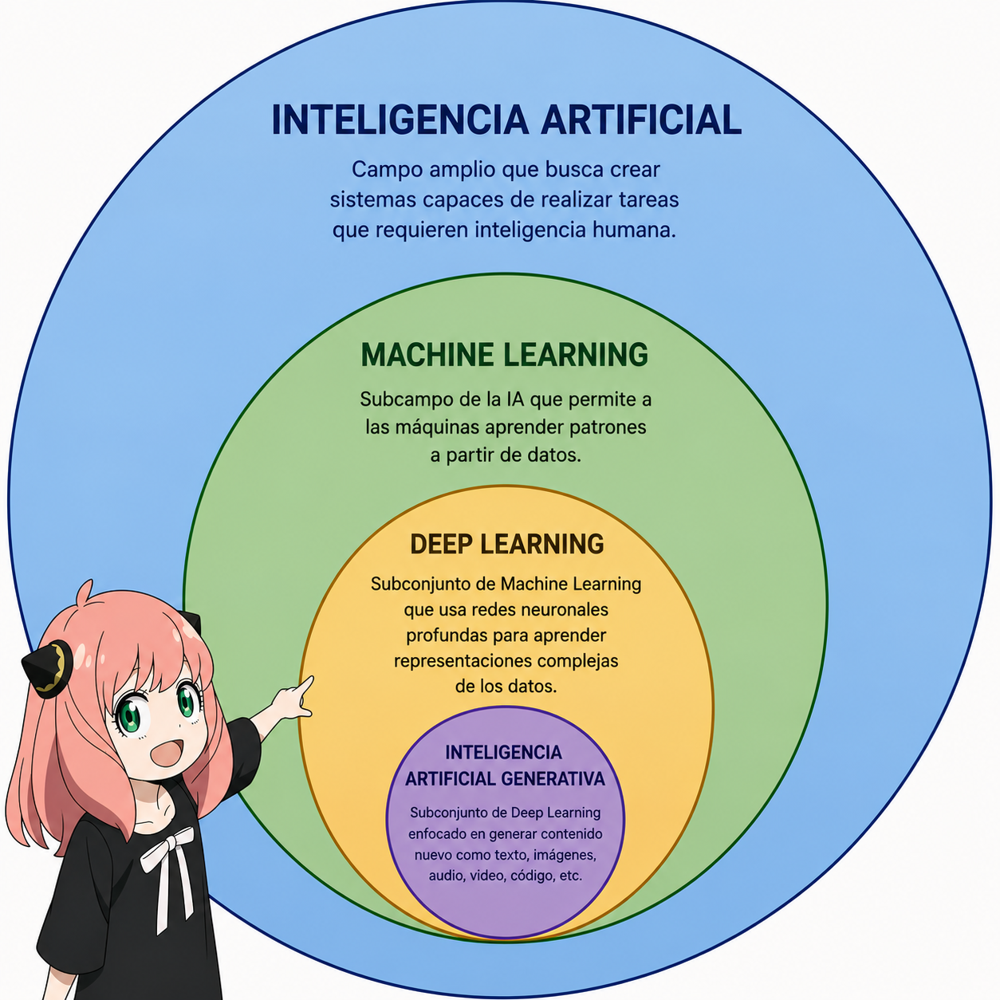

La inteligencia artificial es una Subdisciplina del campo de la informática, que busca la creación de máquinas que puedan imitar comportamientos inteligentes.

---

# Historia

---

# walter pitts y warren mcculloch

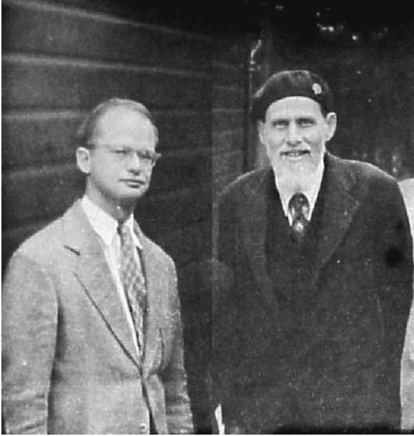

En 1943, Warren McCulloch y Walter Pitts presentaron su modelo de neuronas artificiales en el artículo A Logical Calculus of Ideas Immanent in Nervous Activity. Este modelo sentó las bases para el desarrollo de las redes neuronales artificiales, ya que proponía una neurona capaz de recibir valores binarios y retornar valores binarios, imitando de forma lógica y simplificada el comportamiento del cerebro humano.

---

# Donald Hebb

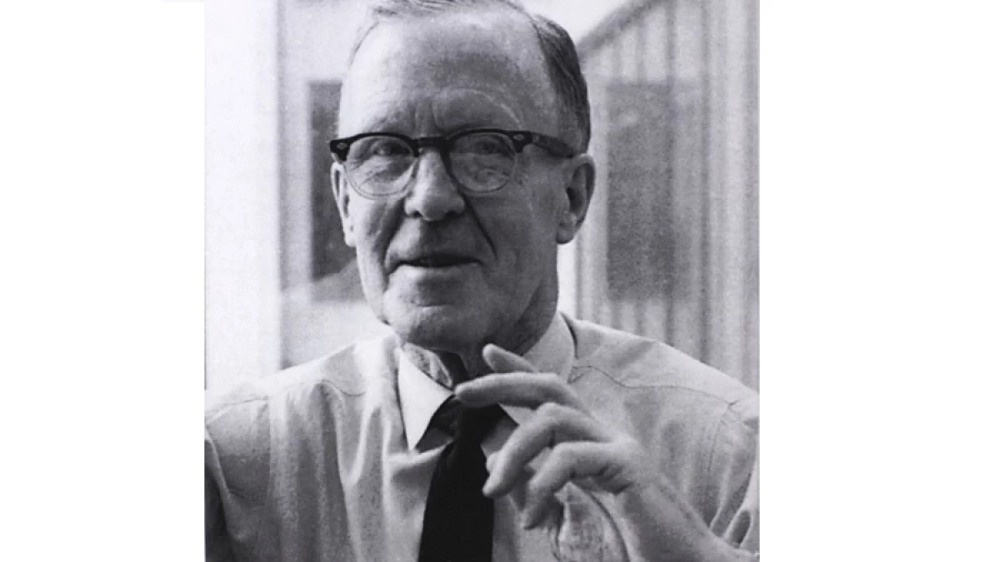 
En 1949, el psicólogo canadiense Donald Hebb publicó el libro The Organization of Behavior, en el que propuso una estructura teórica sobre cómo las neuronas interactúan entre sí mediante conexiones que se fortalecen cuando se activan simultáneamente, formulando así la conocida regla de Hebb. Esta regla se considera fundamental para explicar el aprendizaje y la plasticidad sináptica, ya que describe cómo las experiencias pueden modificar la fuerza de las conexiones neuronales.

---

# Alan Turing

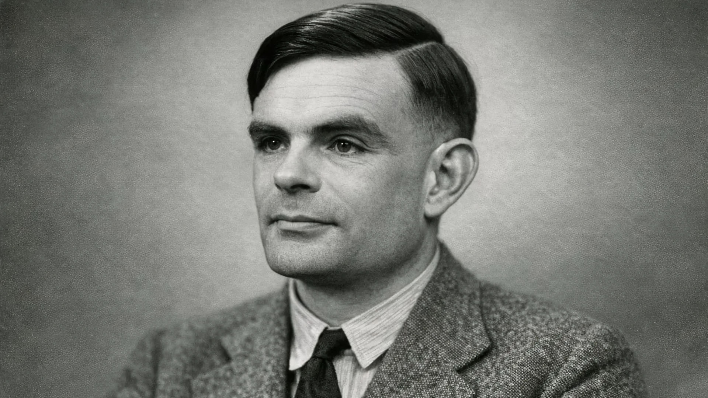

En 1950 Alan Turing publicó Computing Machinery and Intelligence, en el que propuso el test de Turing como criterio para juzgar la inteligencia de una máquina, también introdujo los conceptos de aprendizaje automático, los algoritmos genéricos y el aprendizaje por refuerzo.

---

# Marvin Minsky y Dean Edmonds

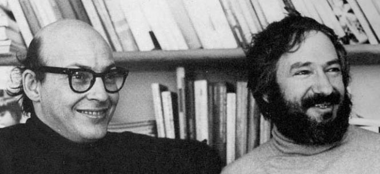

En 1951, Marvin Minsky y Dean Edmonds construyeron el SNARC (Stochastic Neural Analog Reinforcement Calculator), una de las primeras redes neuronales.

---

# Arthur Samuel

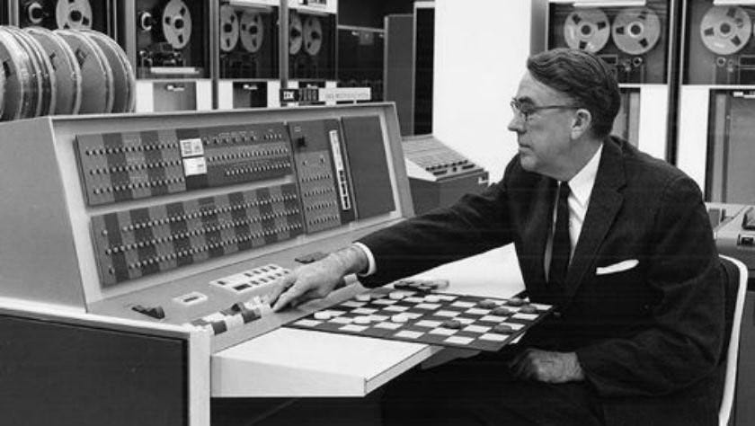

En 1952  Arthur Samuel escribió una serie de programas para el juego de las damas que eventualmente aprendieron a jugar hasta alcanzar un nivel equivalente al de un amateur.
El fue el primero en acunar el termino de machine learning y
El campo de aprendizaje automático se preocupa por el desarrollo de algoritmos que pueden aprender de los datos.

---

# Dartmouth Gang

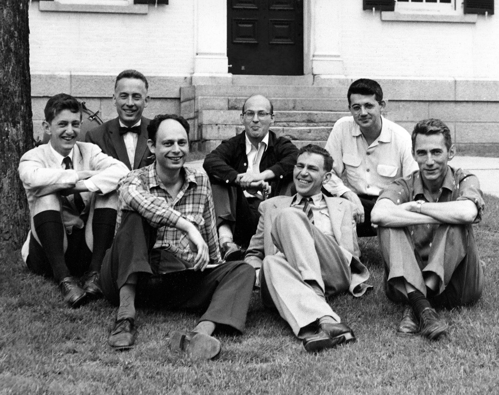

En 1956 John McCarthy Junto a Marvin Minsky, Claude Shannon y Nathaniel Rochester con el fin de fomentar el interese de los investigadores americanos en la teoría de autómatas, las redes neuronales y el estudio de la inteligencia, organizaron un taller de 2 meses de duración en el Dartmouth College.

---

# Herbert Simon

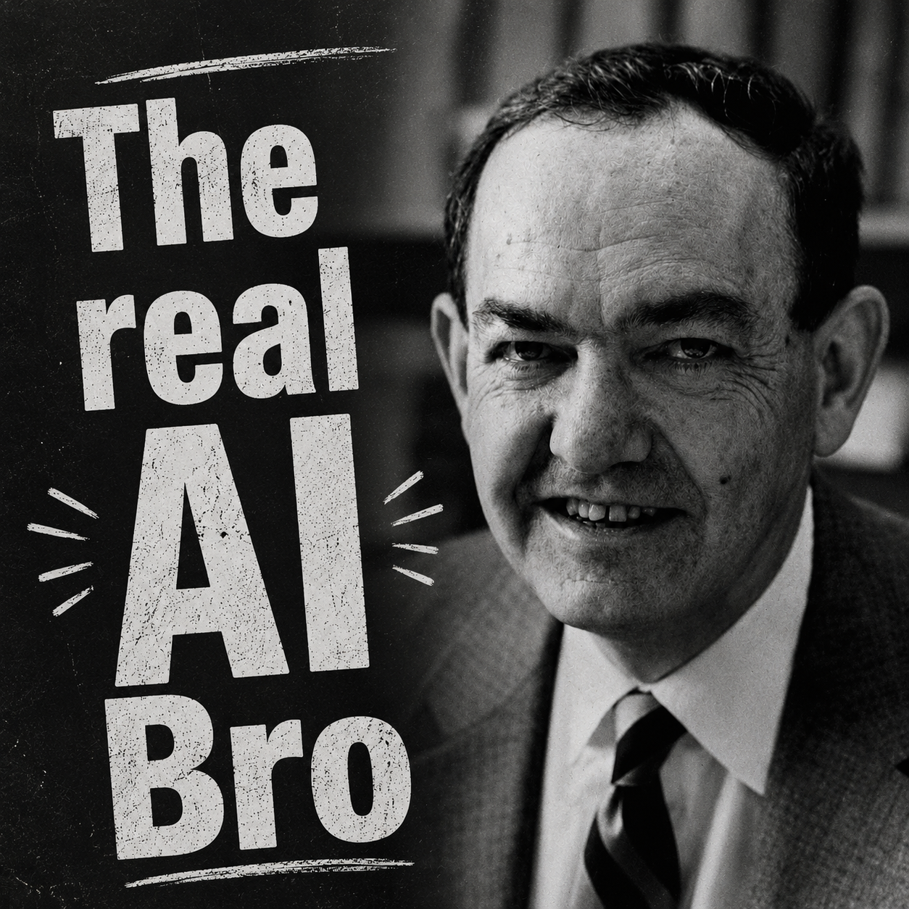

"Actualmente en el mundo existen máquinas capaces de pensar, aprender y crear. Su aptitud para hacer lo anterior aumentará rápidamente hasta que (en un futuro previsible) la magnitud de problemas que serán capaces de resolver irá a la par que la capacidad de la mente humana para hacer lo mismo." - Herbert Simon, 1957.

---

# Inicio de la Traducción Automática

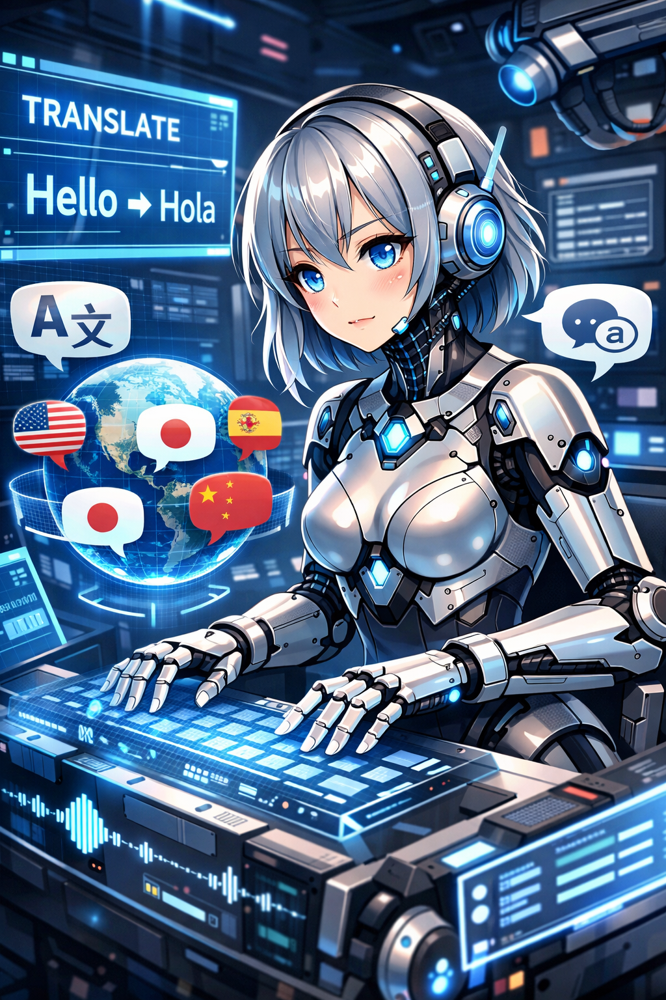

En 1957, la traducción automática fue financiada por el Consejo Nacional para la Investigación de Estados Unidos para agilizar la traducción de artículos científicos rusos tras el lanzamiento del Sputnik.

---

# Frank Rosenblatt

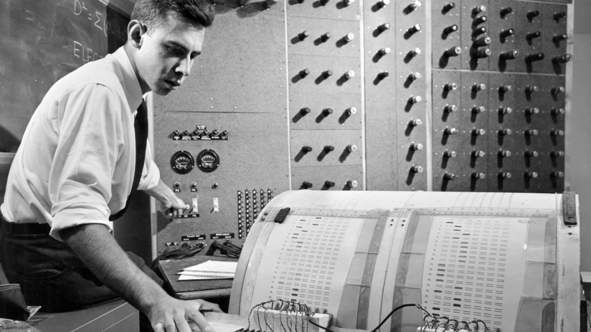
En 1957, Frank Rosenblatt desarrolló el perceptrón, un tipo de red neuronal artificial de una sola capa que era capaz de aprender a reconocer patrones. Representaba una mejora con respecto al modelo de McCulloch y Pitts, ya que podía procesar valores reales y ajustar los pesos para minimizar el error de clasificación. Rosenblatt también desarrolló un algoritmo de aprendizaje supervisado que permitía a la red aprender directamente a partir de los datos.

---

# John McCarthy

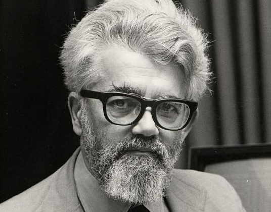

En 1958 John McCarthy mientras trabajada en el MIT realizo 3   contribuciones cruciales: definió el lenguaje de alto nivel Lisp, desarrolló el Time-Sharing y publicó un artículo titulado Programs with Common Sense, en el que describía el Generador de Consejos, un programa hipotético que podría considerarse como el primer sistema de IA completo.

---

#  ADALINE

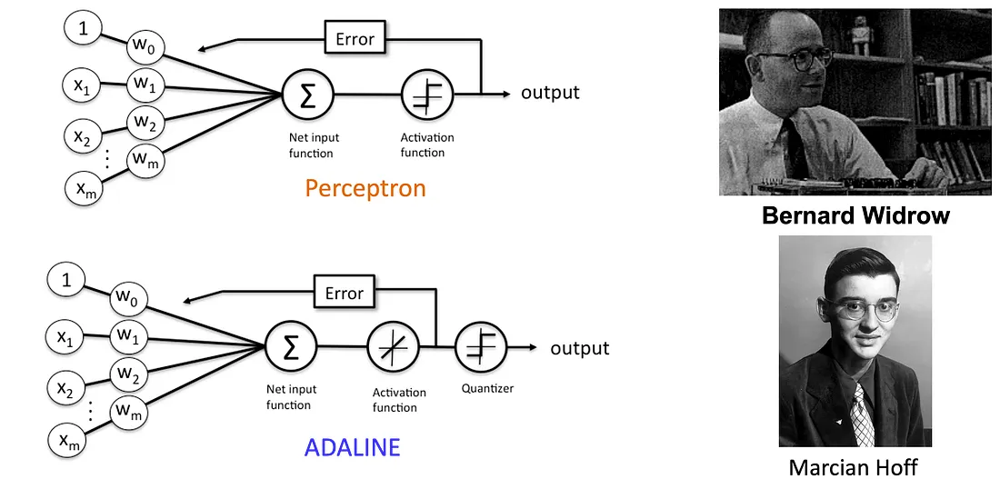

En  1959 Bernard Widrow y Marcian Hoff desarrollaron el ADALINE (Adaptive Linear Neuron), una red neuronal de una sola capa que utilizaba un algoritmo de aprendizaje basado en la regla de Hebb. ADALINE fue uno de los primeros modelos de red neuronal en ser implementado en hardware y se utilizó para resolver problemas de clasificación y reconocimiento de patrones.

---

# Eliza

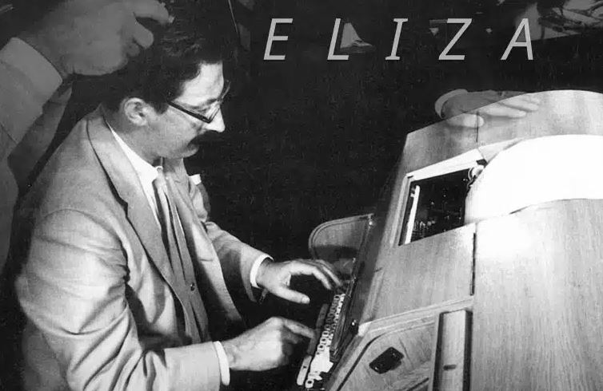
En 1966, Joseph Weizenbaum desarrolló Eliza, un programa de procesamiento de lenguaje natural que simulaba una conversación humana. Eliza utilizaba patrones de texto predefinidos para responder a las entradas del usuario, lo que le permitía mantener conversaciones simples. A pesar de su simplicidad, Eliza fue uno de los primeros programas en demostrar la capacidad de las máquinas para interactuar con los humanos a través del lenguaje natural.

---
# El problema XOR

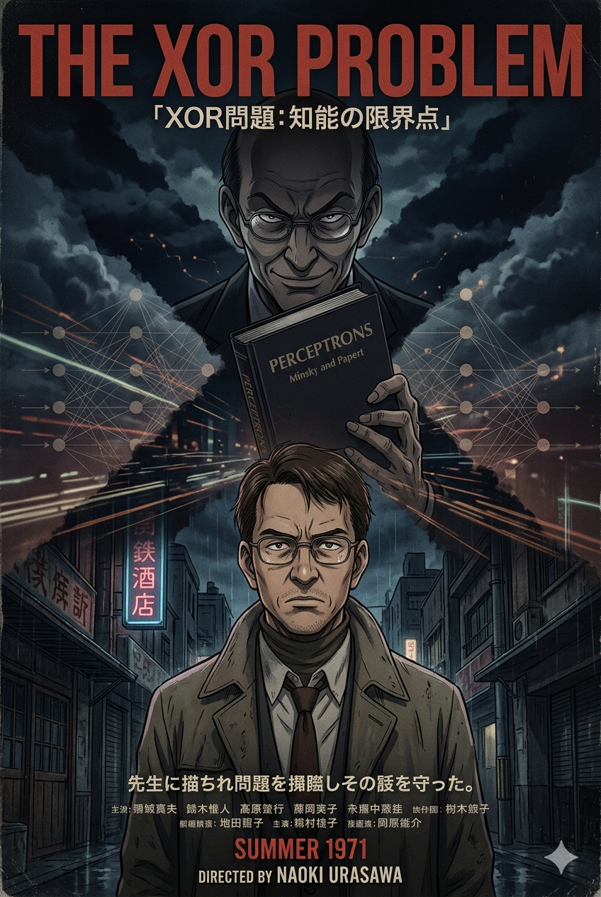

En 1969, en el libro "Perceptrons" de Marvin Minsky y Seymour Papert, se demostró que el perceptrón simple no podía resolver el problema XOR (o exclusivo), debido a que el problema xor no es linealmente separable, lo que llevó a un estancamiento en la investigación de redes neuronales durante varios años.

---

# Deep Blue

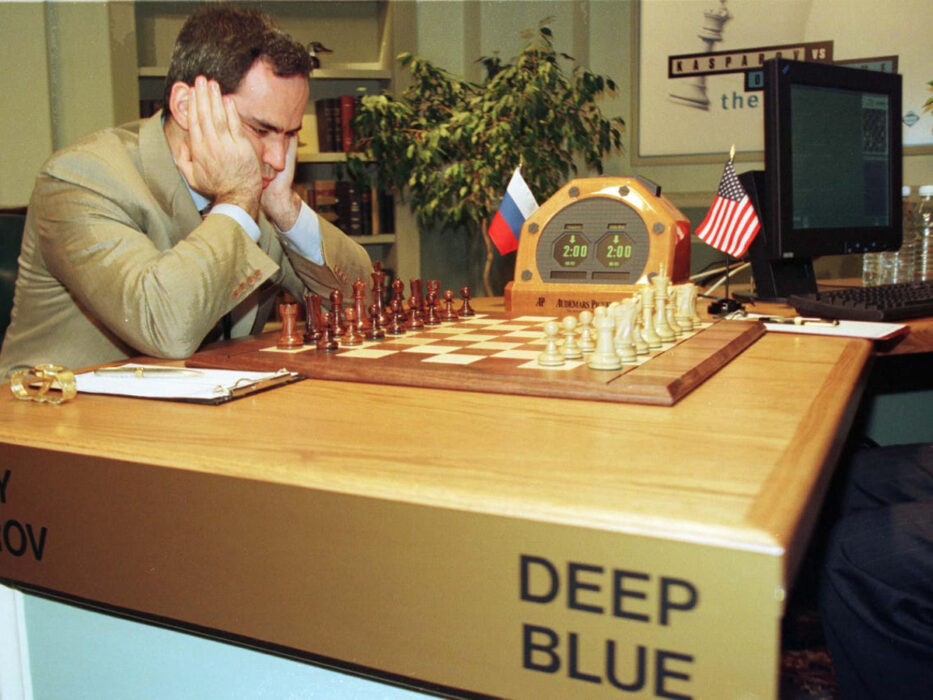
En 1997 una versión actualizada de  Deep Blue la inteligencia artificial creada por IBM se enfrentó al campeón mundial de ajedrez Gary Kasparov y por primera vez una máquina venció a un ser humano en una competencia de esta disciplina.

---

# GAN

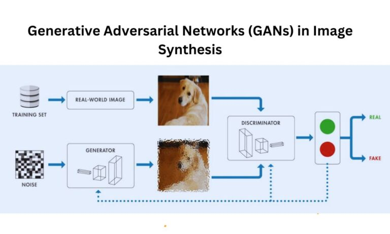

Las redes generativas adversarias (GAN) fueron propuestas por Ian Goodfellow en el año 2014

---

# AlphaGo

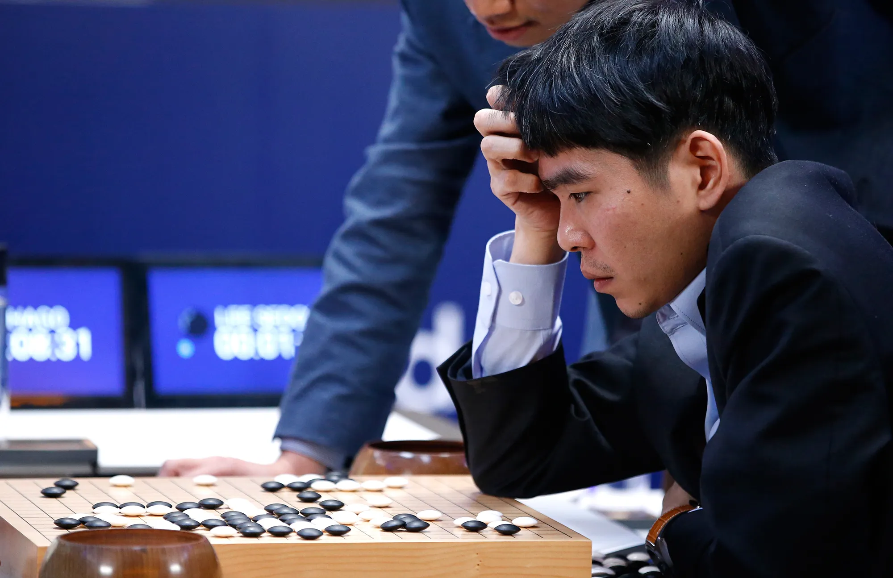

En 2015   AlphaGo, una IA de Google derrotó al campeón mundial de Go, Lee Sedol. El Go es  considerado el juego de estrategia más exigente del mundo.

---

# Modelos de Difussion

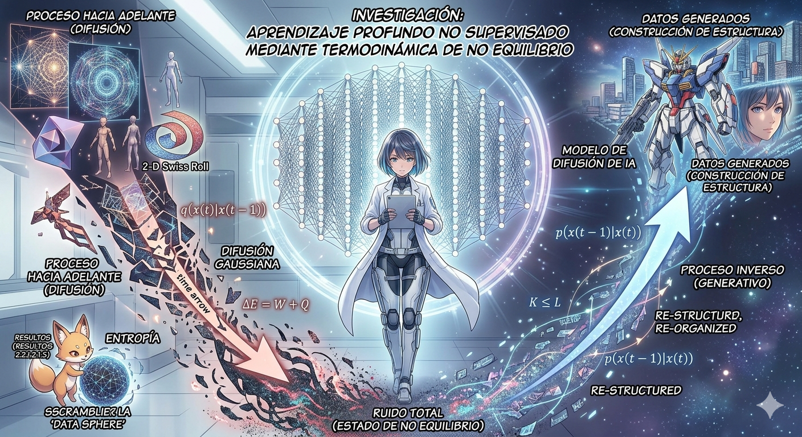
En 2015, se introdujeron los modelos de difusión en un artículo titulado "Deep Unsupervised Learning using Nonequilibrium Thermodynamics" presentado por Jascha Sohl-Dickstein, Eric Weiss, Niru Maheswaranathan y Surya Ganguli.

---

# Transformers

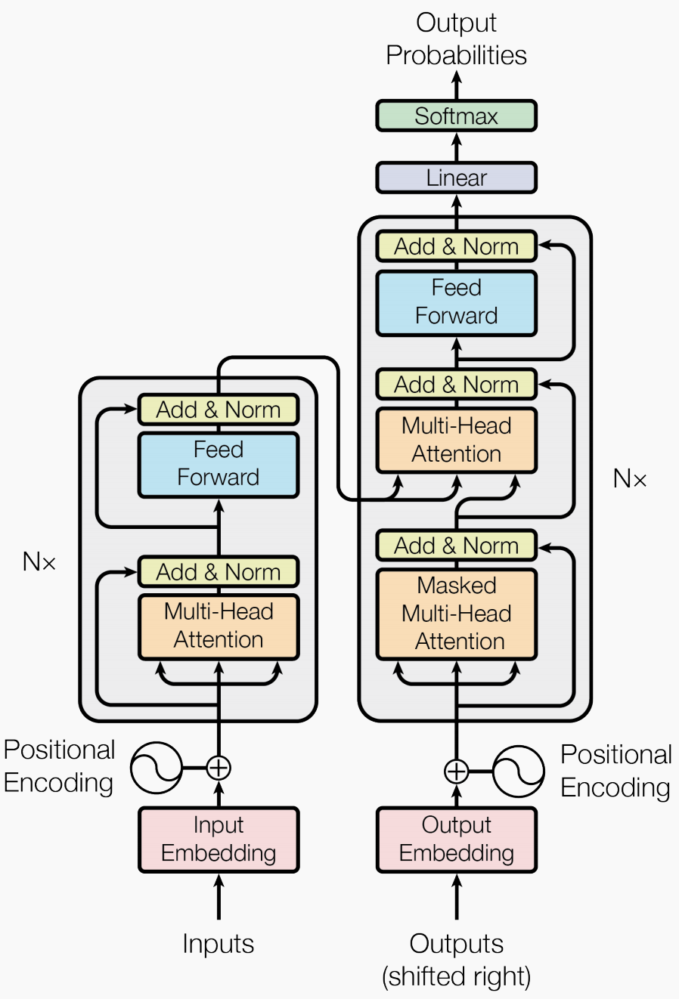
Los Transformers son modelos de aprendizaje profundo, una arquitectura de red neuronal, diseñados para manipular datos secuenciales principalmente en el campo del procesamiento de lenguaje natural (NLP). Los Transformers fueron introducidos en un artículo de investigación de Google en 2017 titulado “Attention Is All You Need”

---

# GPT-3

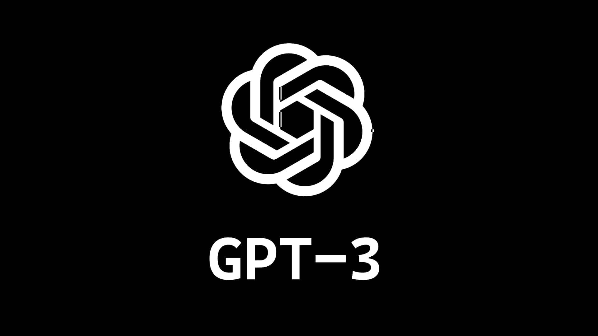

GPT-3 fue introducido en mayo de 2020 y, hasta julio de 2020, se encontraba en fase beta 1. Es parte de una tendencia en sistemas de procesamiento de lenguaje natural (NLP) basados en “representaciones de lenguaje pre-entrenadas”

---

# DALL-E

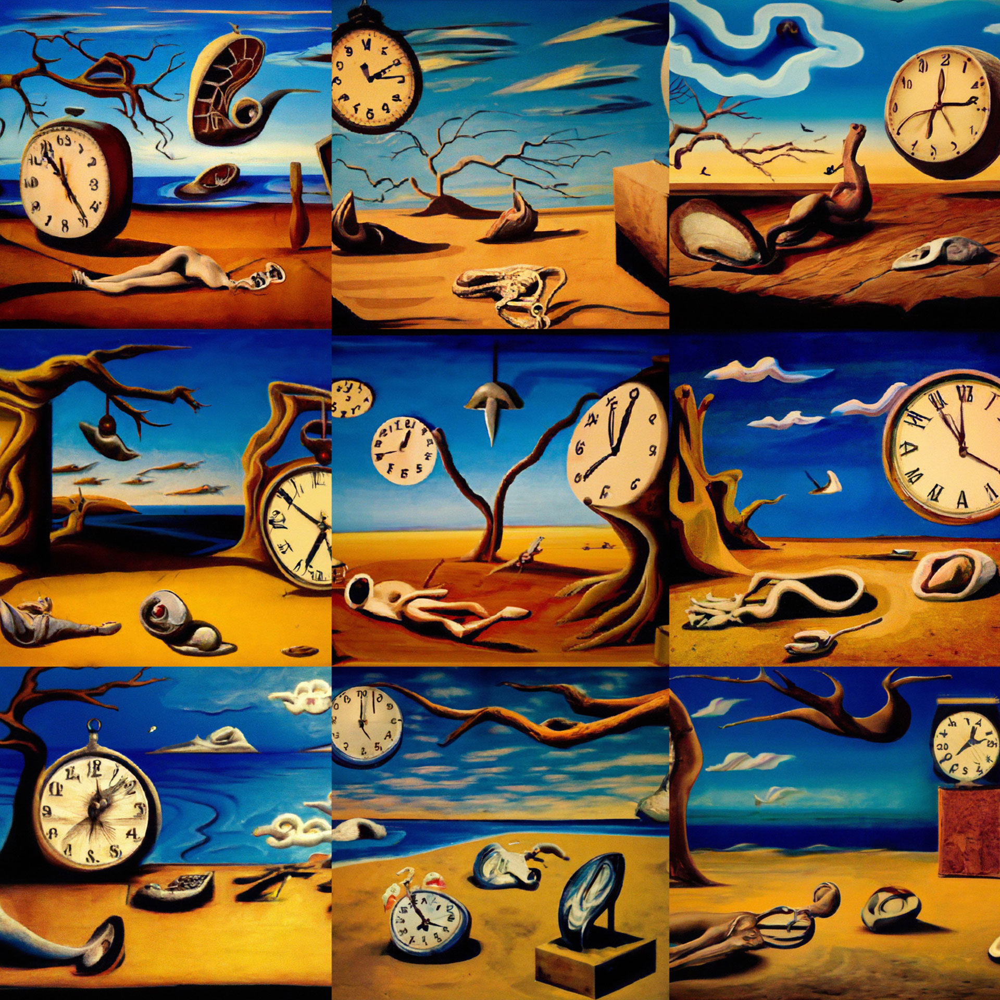

DALL-E es un sistema de inteligencia artificial desarrollado por OpenAI que puede crear imágenes realistas y arte a partir de una descripción en lenguaje natural  . DALL-E fue presentado por OpenAI en enero de 2021

---
# Diffusion Models Beat GANs on Image Synthesis

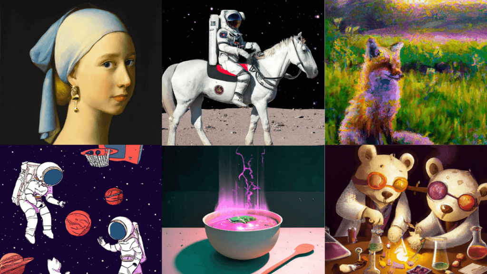
En 2021, un artículo de investigación titulado "Diffusion Models Beat GANs on Image Synthesis" por Prafulla Dhariwal y Alexander Nichol de OpenAI demostró que los modelos de difusión superaban a las redes generativas adversarias (GAN) en la generación de imágenes sintéticas.

--- 

# GitHub Copilot

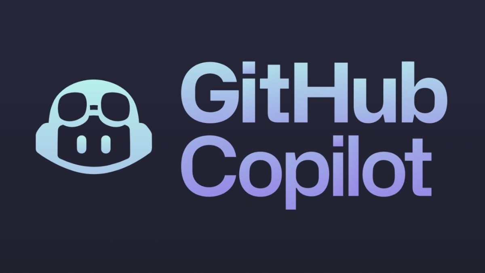

GitHub Copilot es un asistente de programación basado en inteligencia artificial desarrollado por GitHub y OpenAI. Copilot fue lanzado en versión beta el 29 de junio de 2021.

---

# Midjourney

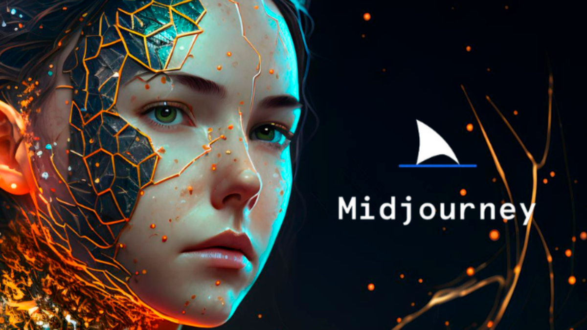

Midjourney es un laboratorio independiente de investigación y el nombre de un programa de inteligencia artificial con el cual sus usuarios pueden crear imágenes a partir de descripciones textuales  . Fue fundado por David Holz, quien también es cofundador de Leap Motion. La herramienta funcionó bajo versión de beta cerrada hasta que el 13 de julio de 2022 el laboratorio anunció el comienzo de una beta abierta.

---

# Stable Diffusion

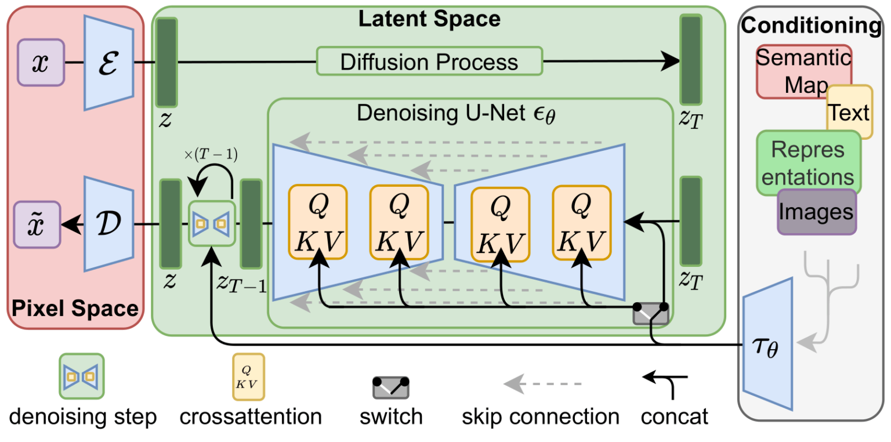

Stable Diffusion fue lanzado inicialmente el 22 de agosto de 2022 . Es un modelo de aprendizaje automático desarrollado por Runway y LMU Munich para generar imágenes digitales de alta calidad a partir de descripciones en lenguaje natural o estímulos  .

---

# Ganador del concurso de arte

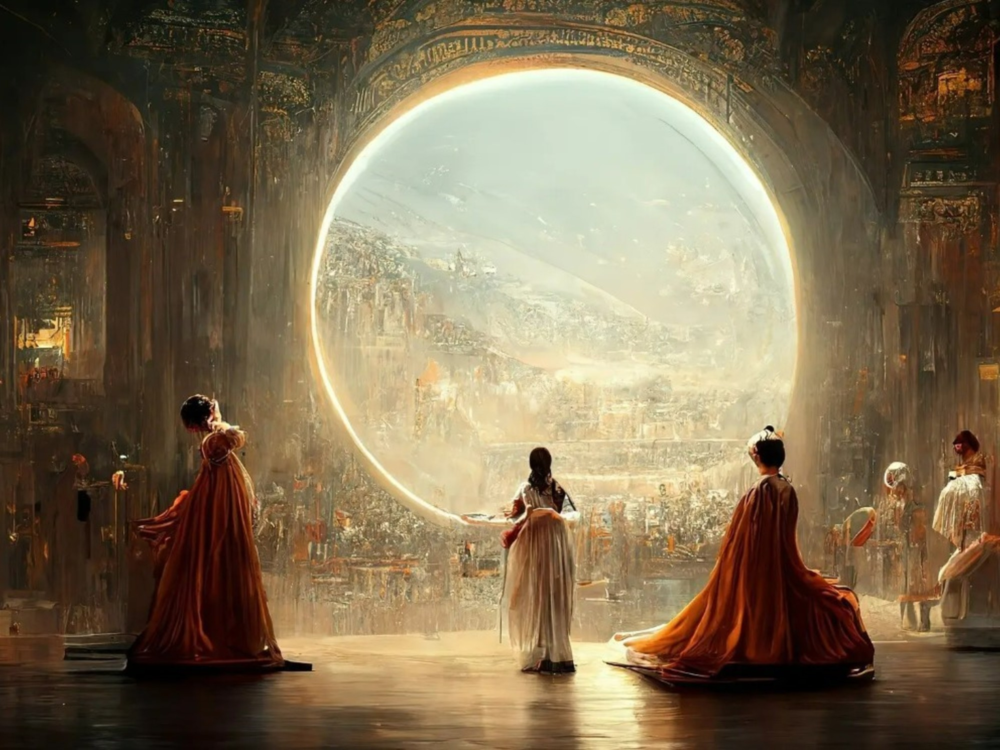

Jason Allen, cuyo nombre de usuario es Sincarnate en Discord, anunció en el canal Midjourney que había ganado el concurso de bellas artes de la Feria Estatal de Colorado, en la categoría de artes digitales  . Utilizó la IA Midjourney para participar en el concurso y acabó ganando la competencia  .

---
# ChatGPT

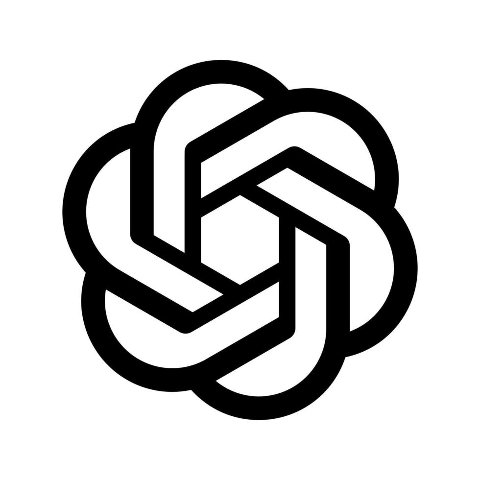

ChatGPT, 30 de noviembre de 2022.

GPT-4, 14 de marzo del 2023

---

# SD3

---

# Flux 2

---

# GPT-image 2

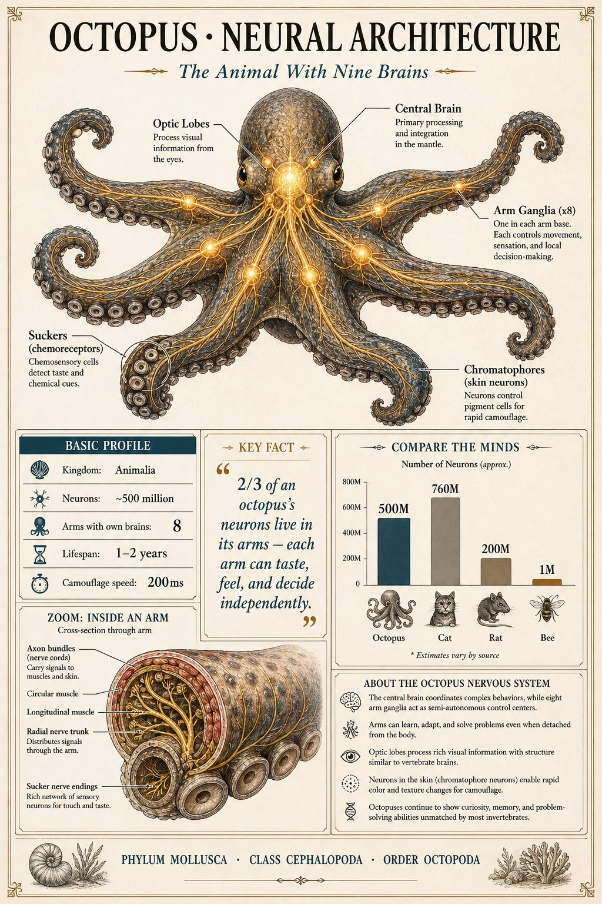

---

# Música

[Ver en YouTube: Música](https://www.youtube.com/watch?v=eh52UhzOKYk)

---
# Video

[Ver en YouTube: Video](https://www.youtube.com/watch?v=k8Ik4WU-Dbw)

---
# Videojuegos

[Ver en YouTube: Videojuegos](https://www.youtube.com/watch?v=dk-mD5djViI)
