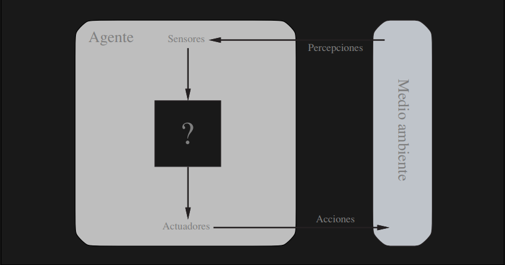
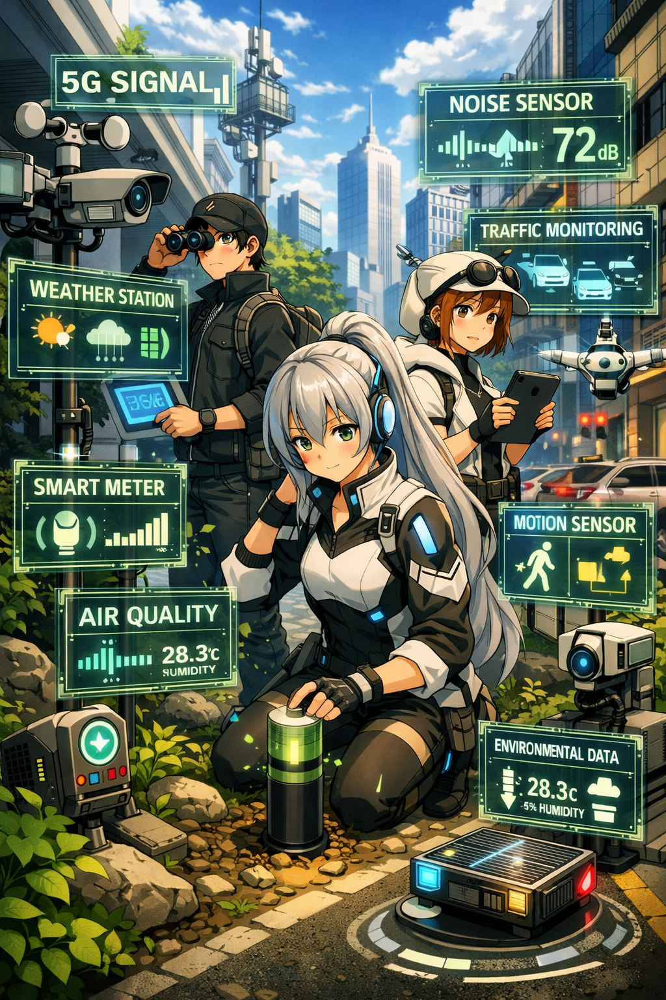
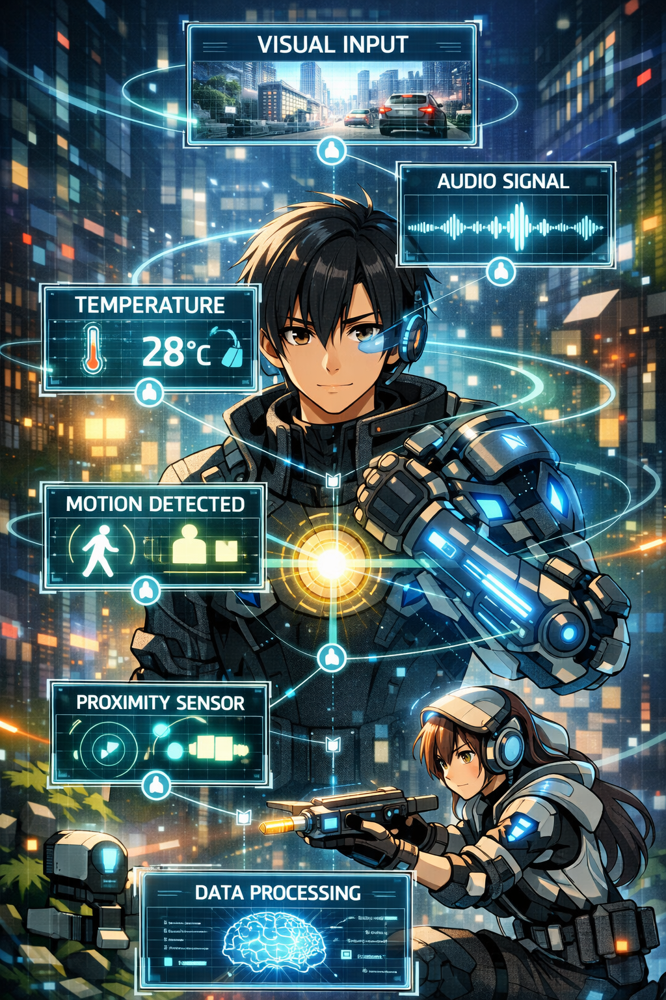
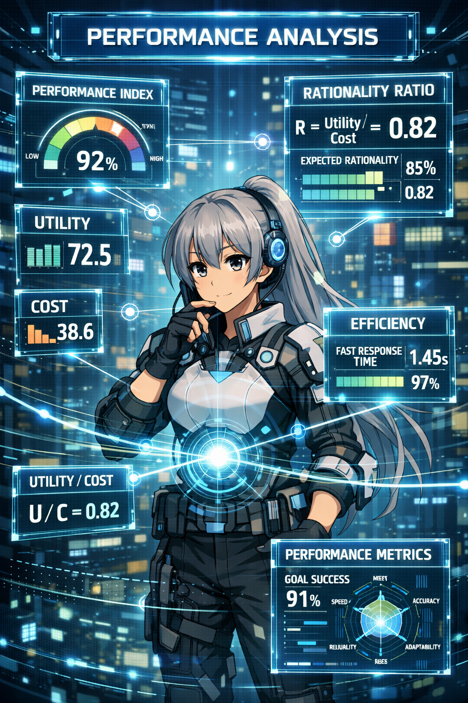
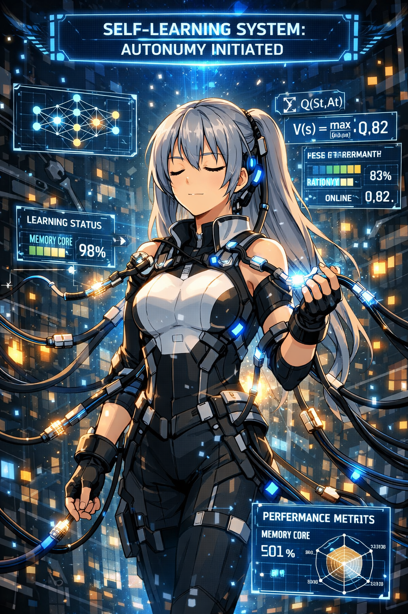
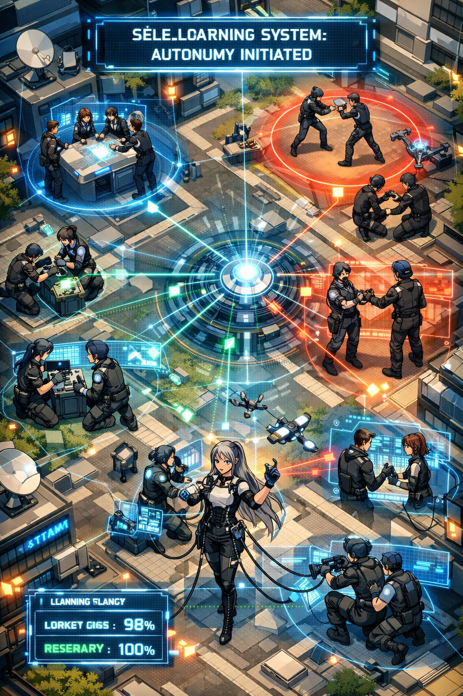
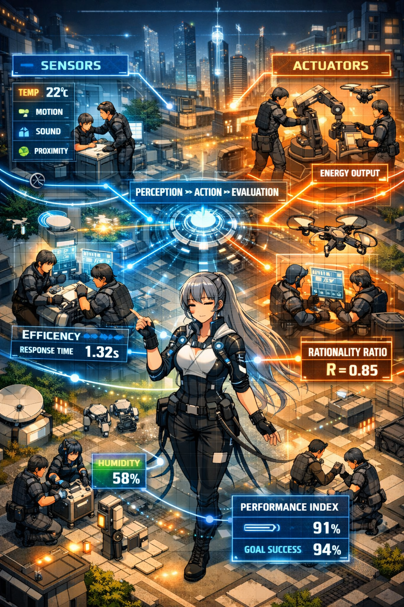
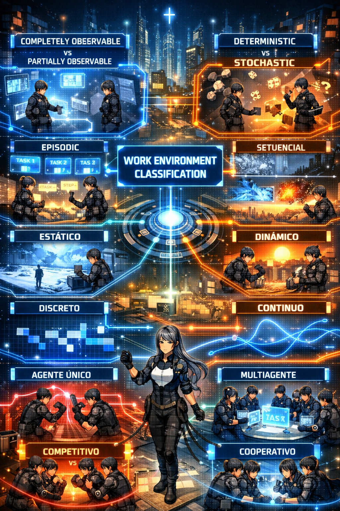
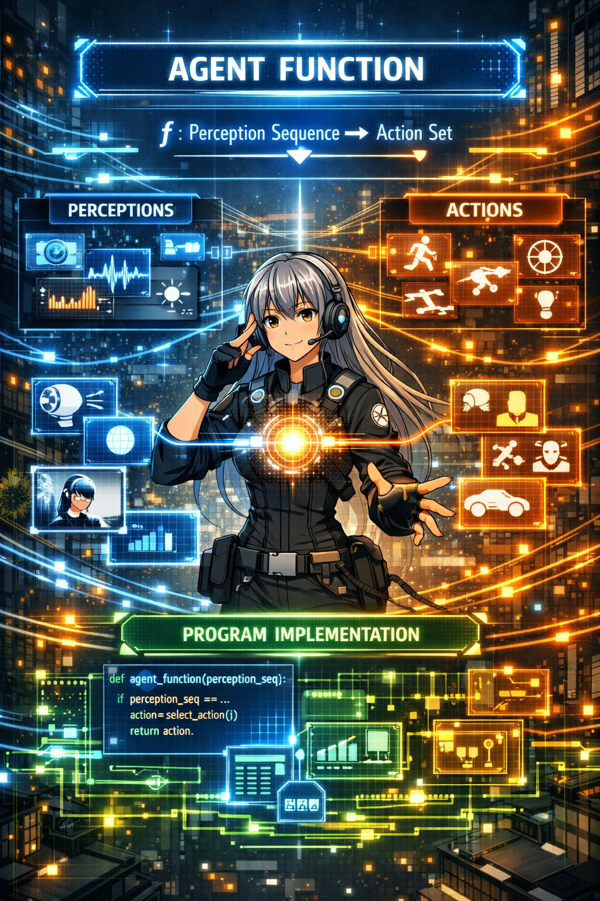
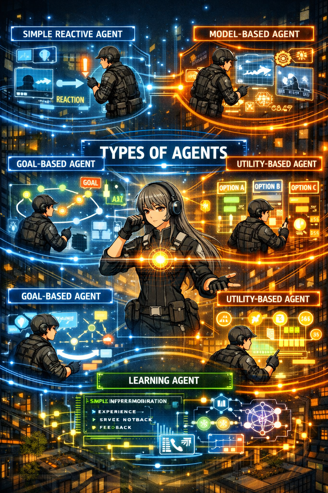

# Inteligencia Artificial

## YOEL ANDEYCI PILIER MARTINEZ

### [yapmartinez@oymas.edu.do](mailto:yapmartinez@oymas.edu.do)

---

# Agentes Inteligentes

---

# Agente Inteligente

Un agente inteligente es cualquier cosa capaz de percibir su medioambiente con la ayuda de sensores y actuar en ese medio utilizando actuadores

---

#  Medio Ambiente

El medio ambiente proporciona el contexto en el cual el agente interactúa, recibe percepciones o entradas, y realiza acciones o salidas.

---

#  Sensores

Un sensor es un dispositivo que detecta y responde a algún tipo de entrada del entorno. Los sensores son los ojos y los oídos de un agente.

---

#  Actuadores

Un actuador es un dispositivo que efectúa una acción. Los actuadores son las manos y los pies de un agente.

---

#  Percepciones

Una percepción es la entrada cruda que recibe un agente a través de los sensores en un momento dado. Las percepciones pueden ser imágenes, sonidos, olores, etc.

---

#  Secuencia de percepciones

La secuencia de percepciones es la historia completa de lo que el agente ha percibido hasta el momento. Es la secuencia de percepciones que determina el comportamiento del agente en cualquier momento.

---

# Racionalidad y Medidas de rendimiento

- Un agente racional es aquel que realiza la acción correcta en cada momento dado. La acción correcta es aquella que permitirá al agente alcanzar su objetivo.

- Las medidas de rendimiento son criterios que se utilizan para evaluar el rendimiento de un agente. Las medidas de rendimiento dependen del entorno en el que se encuentra el agente.

---

#  Omnisicencia

Un agente omnisciente es aquel que conoce el resultado de sus acciones. Un agente racional no tiene por qué ser omnisciente.

---
# Aprendizaje 

Un agente que aprende es aquel que mejora su rendimiento a lo largo del tiempo. Un agente racional no tiene por qué ser un agente que aprende.

---

# Autonomía

Un agente autónomo es aquel que no depende de un control externo. Un agente racional no tiene por qué ser autónomo, aunque si requiere de cierto grado de autonomía.

---

#  Otros

- Habilidad Social
- Adaptabilidad
- Reactividad
- Proactividad

---

# Entornos de trabajo (REAS)

- Medidas de rendimiento
- Entorno
- Actuadores
- sensores

---

#  Clasificacion de los entornos de trabajo

- Completamente Observable vs. Parcialmente Observable
- Determinista vs. Estocástico
- Episódico vs. Secuencial
- Estático vs. Dinámico vs. Semidinámico
- Discreto vs. Continuo
- Agente único vs. Multiagente
- Competitivo vs. Cooperativo

---

# Estructura de los agentes

- La función de agente define el comportamiento del agente. Toma la secuencia de percepciones como entrada y devuelve una acción. La función de agente es una función de mapeo de la secuencia de percepciones al conjunto de acciones.

- El programa es una implementación concreta de la función de agente, generalmente en forma de un programa de computadora.

---

#  Tipos de agentes

---

# Agente reactivo simple

---

# Agente reactivo basado en modelo

---

# Agente basado en objetivos

---

# Agente basado en utilidad

---

# Agentes que aprenden

