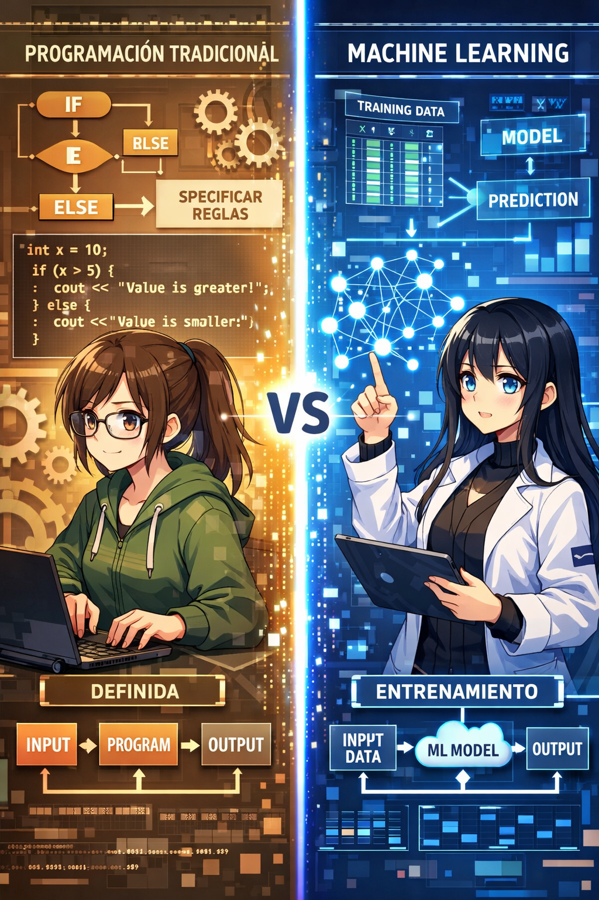
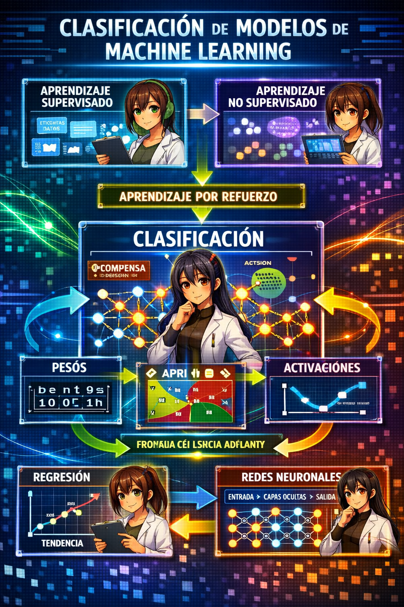
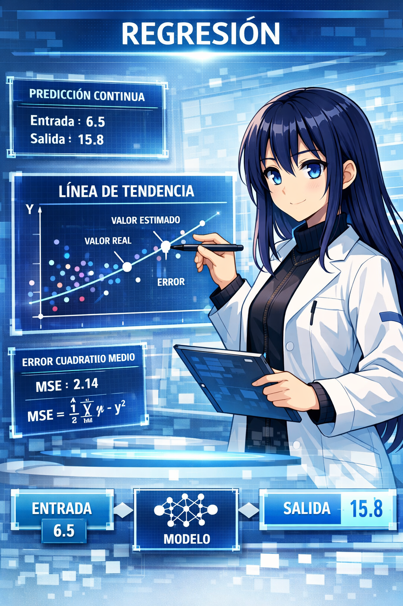
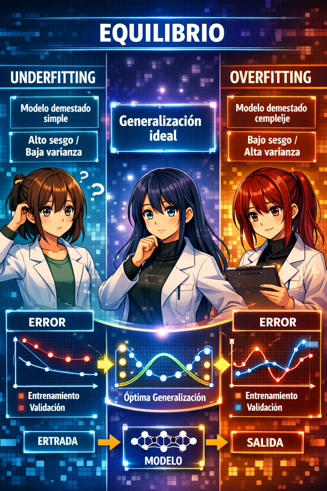
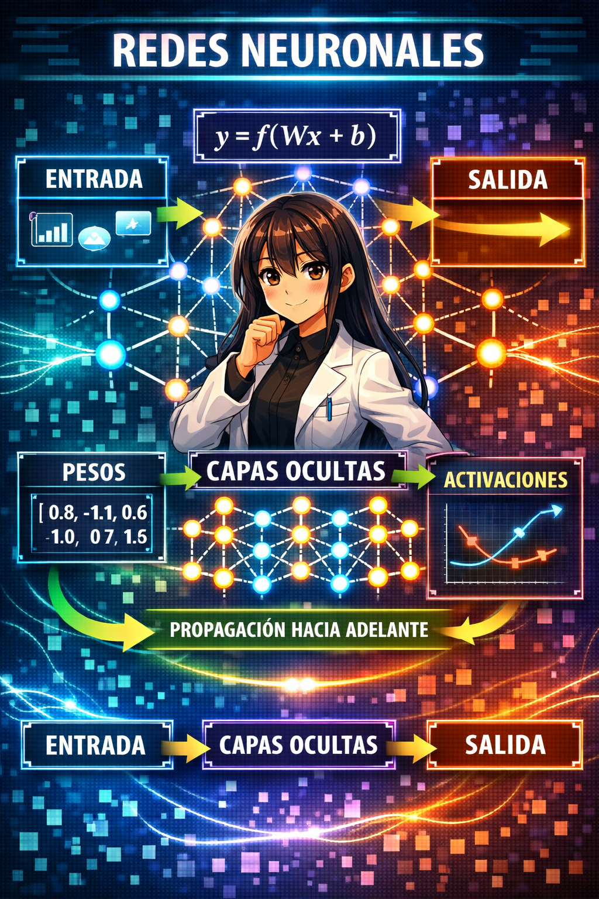
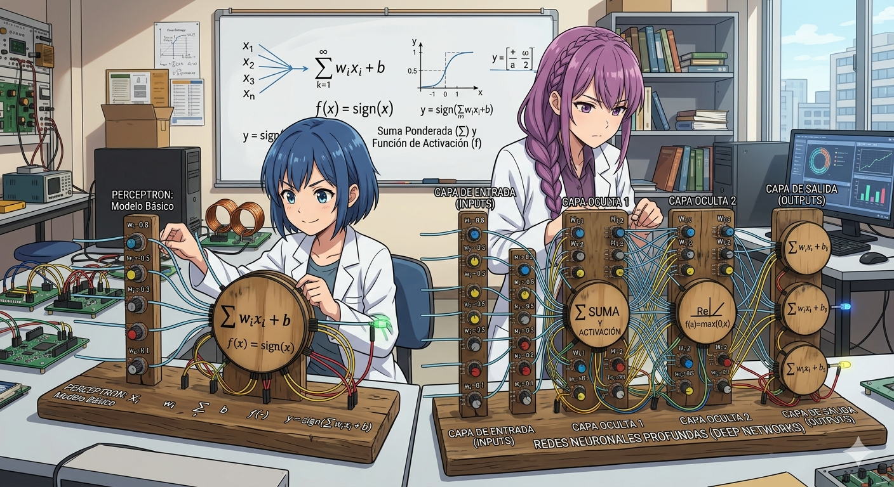
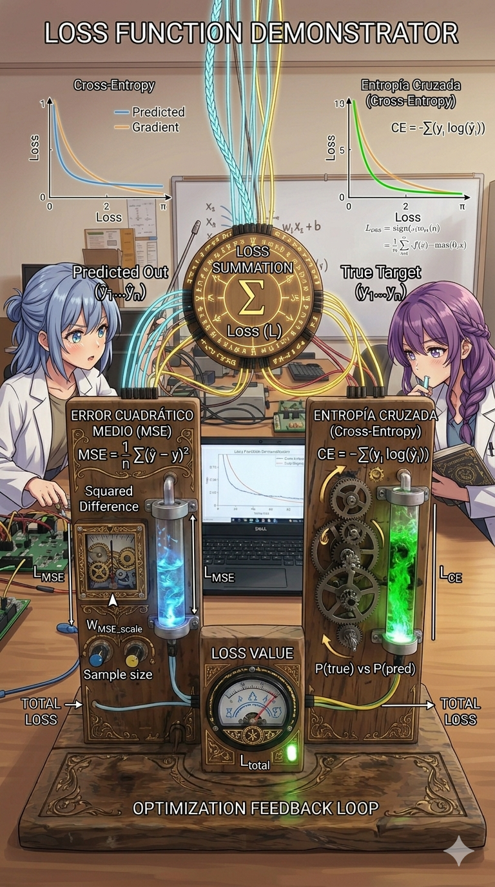
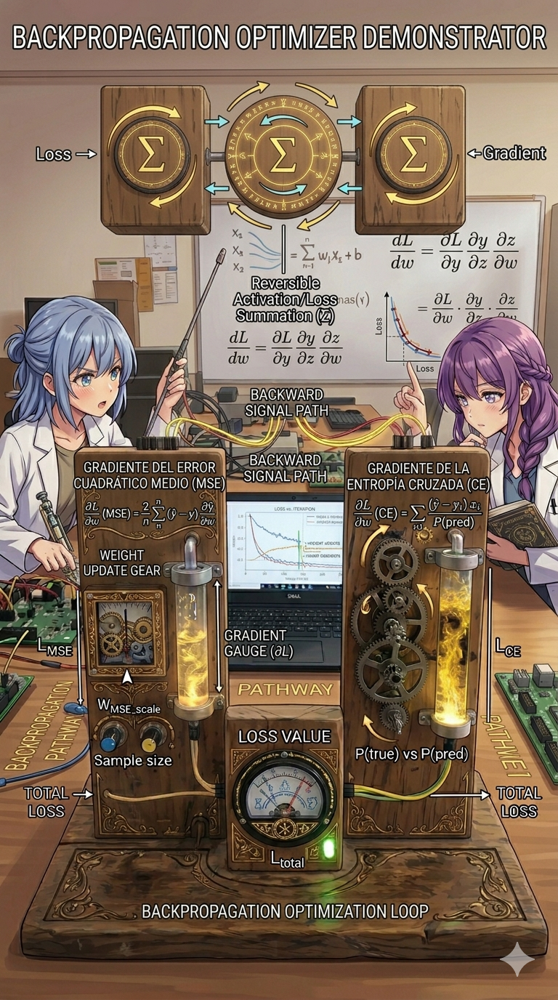
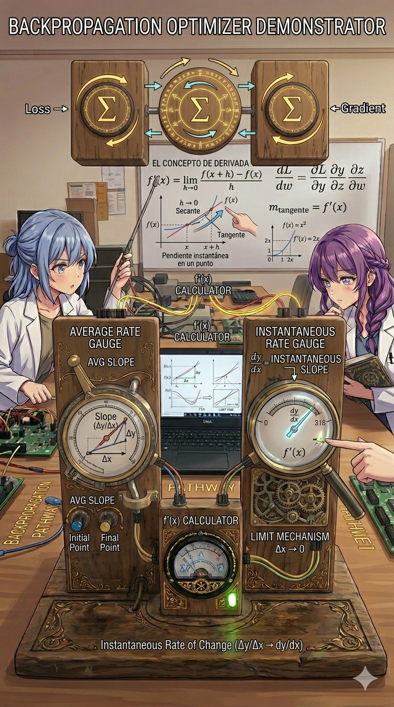
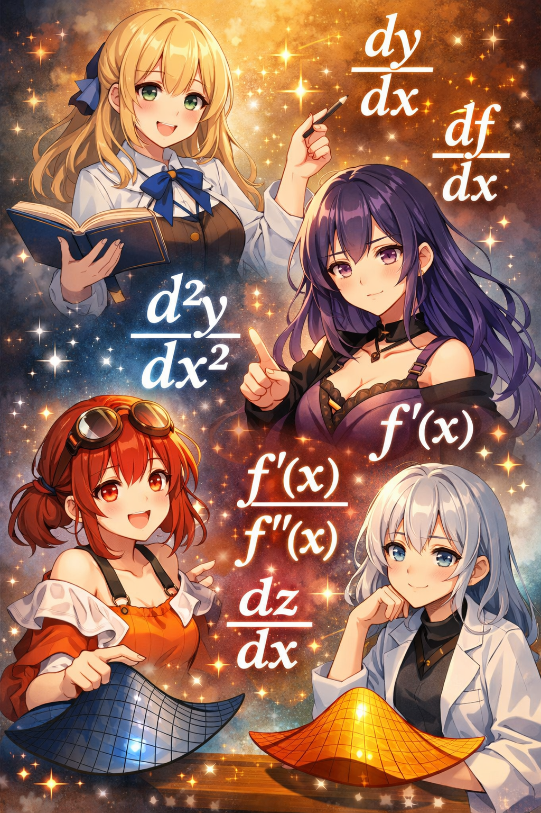

# Inteligencia Artificial

## Yoel Andeyci Pilier Martinez

### [yapmartinez@oymas.edu.do](mailto:yapmartinez@oymas.edu.do)

---

# Machine Learning

El aprendizaje automático o Machine Learning es una rama de la inteligencia artificial que se ocupa del estudio y desarrollo de algoritmos y modelos estadísticos que permiten a las computadoras aprender a realizar una tarea y mejorar automáticamente a partir de datos, sin ser explícitamente programadas para realizar dicha tarea.

---
# Desarrollo Tradicional vs Machine Learning

**Desarrollo tradicional:** el programador define explícitamente las reglas y algoritmos que transforman datos de entrada en resultados de salida.

**Aprendizaje automático:** el programador proporciona datos de entrada y resultados esperados para que el algoritmo aprenda automáticamente el comportamiento necesario durante el entrenamiento y luego pueda predecir nuevos casos.

---

# Clasificación 

---

# Aprendizaje supervisado

En el aprendizaje supervisado, los algoritmos se alimentan de un conjunto de datos de entrada, los cuales pueden ser continuos o discretos, junto con una variable de respuesta correspondiente. Este enfoque se divide en dos categorías principales: clasificación y regresión.

---
# Clasificación

En la clasificación, el objetivo es asignar cada instancia de entrada a una categoría o clase predefinida. Por ejemplo, se puede utilizar el aprendizaje supervisado para clasificar correos electrónicos en spam o no spam, o para identificar el contenido de imágenes en diferentes categorías.

---

# Regresión

En la regresión, se aplica cuando se busca predecir un valor numérico continuo. Por ejemplo, se puede utilizar el aprendizaje supervisado para predecir el precio de una vivienda en función de características como el tamaño, la ubicación, etc.

---

# Aprendizaje no supervisado

En el aprendizaje no supervisado, los algoritmos de aprendizaje se utilizan cuando no se dispone de una variable de respuesta específica. En su lugar, el enfoque se centra en descubrir patrones, estructuras, relaciones, tendencias, agrupamientos y/o anomalías en los datos de entrada. 

---

# Aprendizaje por refuerzo

El aprendizaje por refuerzo es una modalidad de aprendizaje automático en la cual un agente aprende a tomar decisiones en un entorno a través de recompensas o castigos por sus acciones. 

---

# Modelos de Machine Learning

Un modelo es una representación matemática o computacional que captura las relaciones y patrones subyacentes en los datos. Se crea a partir de un conjunto de datos de entrenamiento y se utiliza para realizar predicciones o tomar decisiones sobre nuevos datos.

---

# Pasos para crear un modelo

- Recopilación de datos
- Explorar y preparar los datos
- Seleccionar y entrenar un modelo
- Evaluación del rendimiento del modelo
- Mejora del rendimiento del modelo

---

# Underfitting y overfitting

**Underfitting (subajuste):** ocurre cuando el modelo es demasiado simple para capturar los patrones y la complejidad de los datos, produciendo un bajo rendimiento tanto en entrenamiento como en prueba.

**Overfitting (sobreajuste):** ocurre cuando el modelo es demasiado complejo y aprende excesivamente los datos de entrenamiento, incluyendo ruido y patrones irrelevantes, logrando un rendimiento muy alto en entrenamiento pero deficiente en datos de prueba.

---

# Redes neuronales artificiales

Las redes neuronales artificiales (ANN) son modelos computacionales inspirados en el funcionamiento del cerebro humano, diseñados para aprender patrones a partir de datos y resolver problemas de inteligencia artificial. Están formadas por neuronas organizadas en capas que procesan información y ajustan sus conexiones durante el entrenamiento para mejorar sus predicciones o decisiones.

---

# La red neuronal(forward pass)

**perceptron**:
$$y = \text{sign}\left( \sum_{i=1}^{n} w_i x_i + b \right)$$

**mlp**:
$$a^{(l)} = \sigma\left( W^{(l)} a^{(l-1)} + b^{(l)} \right)$$

**función de activación**:
$$\sigma(z) = \frac{1}{1 + e^{-z}}$$

---

# Perdida

La función de pérdida cuantifica la diferencia entre las predicciones del modelo y los valores reales, proporcionando una medida de qué tan bien el modelo se ajusta a los datos.

**MSE**:
$$L(\hat{y}, y) = \frac{1}{n} \sum_{i=1}^{n} (\hat{y}_i - y_i)^2$$

---
# Backpropagation

El algoritmo de retropropagación (backpropagation) es un método utilizado para entrenar redes neuronales artificiales, ajustando los pesos de las conexiones entre las neuronas para minimizar la función de pérdida.

$$\frac{dL}{dw} = \frac{\partial L}{\partial \hat{y}} \cdot \frac{\partial \hat{y}}{\partial z} \cdot \frac{\partial z}{\partial w}$$

---
# Derivadas

Las derivadas son la tasa de cambio de una función con respecto a una variable. En el contexto del aprendizaje automático, se utilizan para calcular cómo ajustar los pesos de un modelo durante el entrenamiento.

**Definición por límite**:

$$f'(x) = \lim_{h \to 0} \frac{f(x+h) - f(x)}{h}$$

**Ejemplo**:

$$f(x) = x^2 \implies f'(x) = 2x$$

---
# Gradientes

**Error en la salida ($\delta$):**
$$\delta = \frac{2}{n}(\hat{y} - y) \cdot \sigma'(z)$$

**Derivada de la Sigmoide:**
$$\sigma'(z) = \sigma(z)(1 - \sigma(z))$$

**Gradientes de los parámetros:**
**Pesos:** $\frac{\partial L}{\partial W} = \delta \cdot x$

**Sesgo:** $\frac{\partial L}{\partial b} = \delta$
**Entrada:** $\frac{\partial L}{\partial x} = \delta \cdot W$

---
# Optimización

**SGD Estándar**:

$$w_{t+1} = w_t - \eta \nabla L(w_t)$$

**SGD con Momentum**:

$$v_{t+1} = \gamma v_t + \eta \nabla L(w_t)$$
$$w_{t+1} = w_t - v_{t+1}$$

>Rumelhart, D. E., Hinton, G. E., & Williams, R. J. (1986). Learning representations by back-propagating errors. *Nature*, 323(6088), 533-536. 

