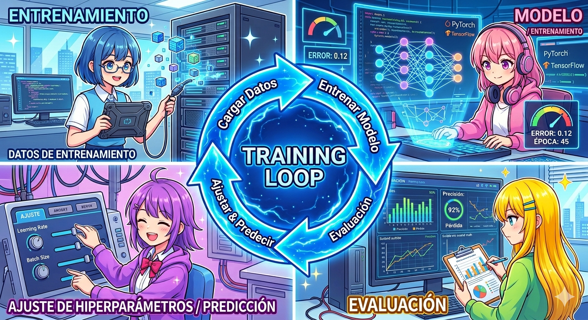
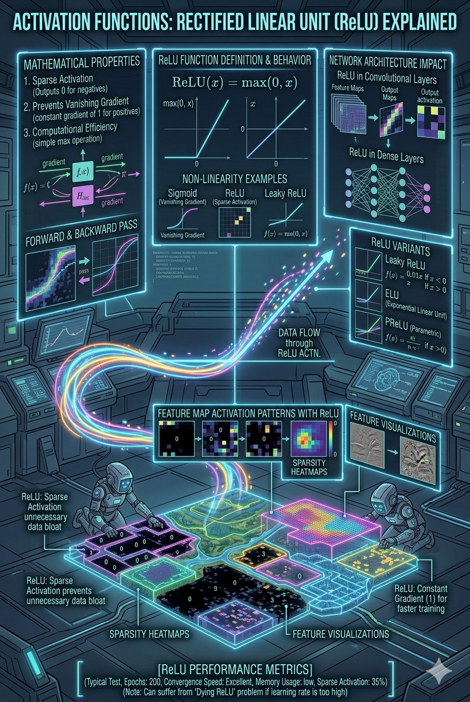
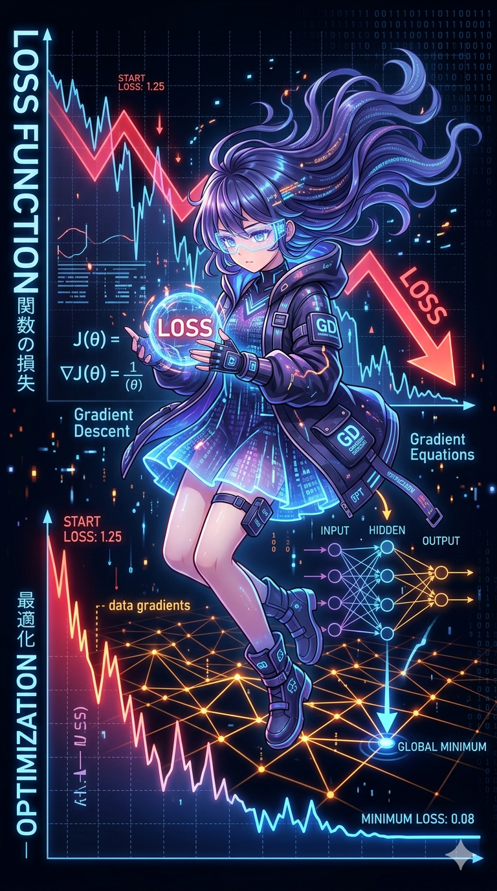
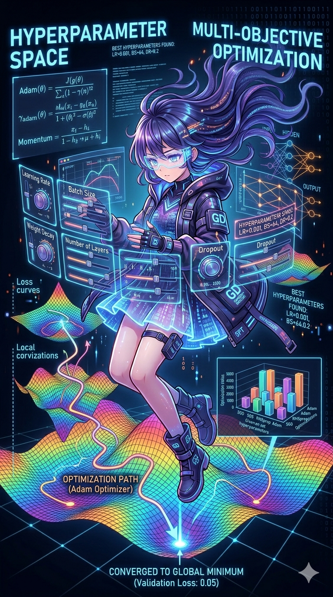
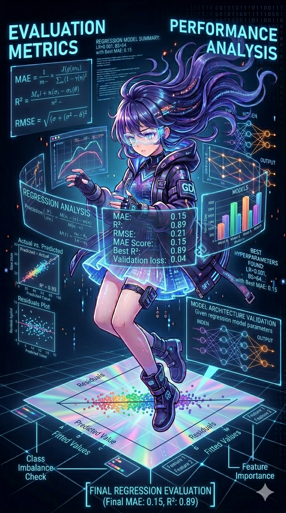
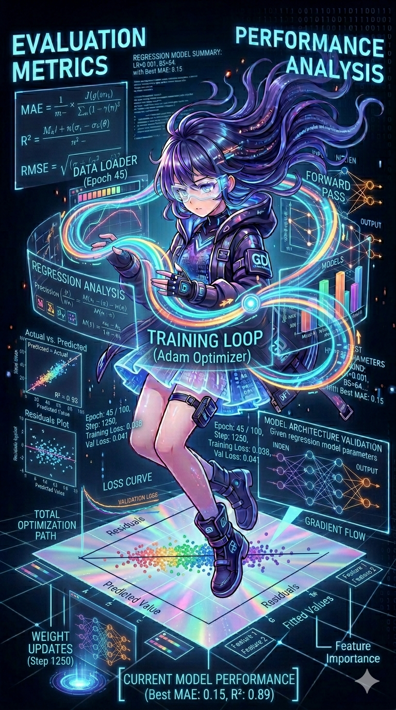
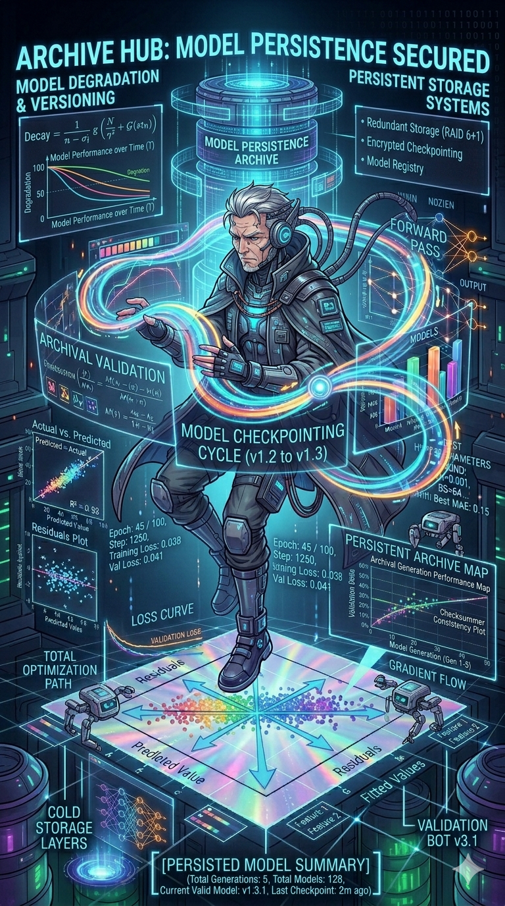
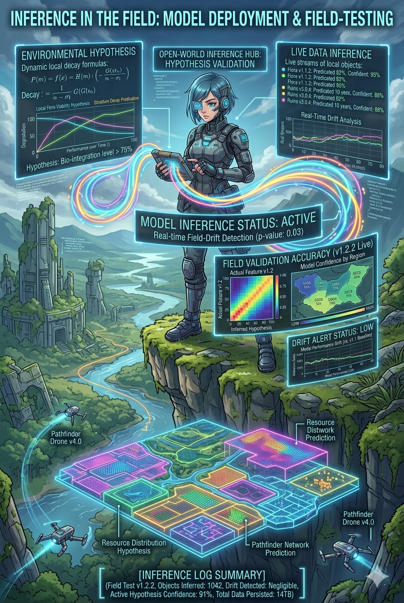

# Inteligencia Artificial

## Yoel Andeyci Pilier Martinez

### [yapmartinez@oymas.edu.do](mailto:yapmartinez@oymas.edu.do)

---
# Entrenamiento de modelos



---

# Pytorch Autograd


- torch.Parameter
- tensor.backward()
- torch.nn.Linear
- torch.nn.Module

--- 
# Definir el problema / Recopilar los datos


- Obtener los datos
- Preprocesar los datos
- Dividir los datos en conjuntos de entrenamiento, validación y/o prueba
--- 
# Problema: Convertir grados Celsius a grados Fahrenheit


- Fórmula: F = (C * 9/5) + 32

```python
data_train_x = [-100.0, -95.0, -90.0, -85.0, -80.0, -75.0, -70.0, -65.0, -60.0, -55.0, -50.0, -45.0, -40.0, -35.0, -30.0, -25.0, -20.0, -15.0, -10.0, -5.0, 0.0, 5.0, 10.0, 15.0, 20.0, 25.0, 30.0, 35.0, 40.0, 45.0, 50.0, 55.0, 60.0, 65.0, 70.0, 75.0, 80.0, 85.0, 90.0, 95.0, 100.0]
data_train_y = [-148.0, -139.0, -130.0, -121.0, -112.0, -103.0, -94.0, -85.0, -76.0, -67.0, -58.0, -49.0, -40.0, -31.0, -22.0, -13.0, -4.0, 5.0, 14.0, 23.0, 32.0, 41.0, 50.0, 59.0, 68.0, 77.0, 86.0, 95.0, 104.0, 113.0, 122.0, 131.0, 140.0, 149.0, 158.0, 167.0, 176.0, 185.0, 194.0, 203.0, 212.0]
data_test_x = [-100.0, -50.0, 0.0, 25.0, 50.0, 75.0, 100.0, -20.0, 10.0, 30.0]
data_test_y = [-148.0, -58.0, 32.0, 77.0, 122.0, 167.0, 212.0, -4.0, 50.0, 86.0]
```

---
# Preprocesar datos


- Normalización Min-Max
$$x' = \frac{x - x_{min}}{x_{max} - x_{min}}$$

- Desnormalización Min-Max
$$x = x' (x_{max} - x_{min}) + x_{min}$$

- Normalización Z-Score
$$x' = \frac{x - \mu}{\sigma}$$

- Desnormalización Z-Score
$$x = x' \sigma + \mu$$

--- 

# Los datos en PyTorch


- Dataset
- DataLoader
- Device

---

# El modelo


- Arquitectura del modelo
- Función de pérdida
- Optimizador e hiperparámetros
- Métricas de evaluación
- Training loop
- Persistencia del modelo
- inferencia

---
# Arquitectura del modelo


- Número de capas
- Número de neuronas por capa
- Funciones de activación 


> x-> [Linear(4,bias)] -> [ReLU] 
-> [Linear(4,bias)] -> [ReLU] 
-> [Linear(1)] -> y

---

# Funciones de activación



$$\text{ReLU}(x) = \max(0, x)$$


derivada de ReLU

$$\text{ReLU}'(x) = \begin{cases} 0 & \text{si } x < 0 \\ 1 & \text{si } x > 0 \\ \text{indefinido} & \text{si } x = 0 \end{cases}$$

---


# Función de pérdida



- MSE (Mean Squared Error)
$$MSE = \frac{1}{n} \sum_{i=1}^{n} ( \hat{y}_i-y_i)^2$$

- Derivada de MSE
$$\text{MSE}' = \frac{2}{n}(\hat{y} - y)$$

---

# Optimizador e hiperparámetros

SGD with momentum and nesterov



$$v = \mu v - \eta \nabla L(\theta + \mu v)$$
$$\theta = \theta + v$$
- Learning rate : $\eta$ = 1e-3
- Momentum : $\mu$ = 0.9
- Nesterov : True
- epocas = 10000

---

# Métricas de evaluación




- MAE (Mean Absolute Error)
$$MAE = \frac{1}{n} \sum_{i=1}^{n} |\hat{y}_i - y_i|$$


- MAE derivada
$$\text{MAE}' = \frac{1}{n}\cdot\text{sign}(\hat{y} - y)$$

donde:

$$
\text{sign}(x)=
\begin{cases}
+1 & x > 0 \\
0 & x = 0 \\
-1 & x < 0
\end{cases}
$$

---

# Métricas de evaluación


- R² (Coeficiente de determinación)

$$R^2 = 1 - \frac{\sum_{i=1}^{n} (y_i - \hat{y}_i)^2}{\sum_{i=1}^{n} (y_i - \bar{y})^2}$$

---

# Training Loop 



```plaintext
Datos
   ↓
Gradientes en cero
   ↓ 
Forward Pass
   ↓
Cálculo de pérdida
   ↓
Backpropagation
   ↓
Actualización de pesos
   ↓
evaluación

```

---
# Persistencia del modelo



- Guardar el modelo
```pythonpython
from safetensors.torch import save_model
save_model(model, "model.safetensors")
```
- Cargar el modelo
```pythonpython
from safetensors.torch import load_model
model = MyModel()
load_model(model, "model.safetensors")
```

---
# Inferencia



```python
model.eval()
with torch.no_grad():
    for x in data_test_x:
        x_tensor = torch.tensor([x], dtype=torch.float32)
        y_pred = model(x_tensor)
        print(f"Predicción para {x}°C: {y_pred.item()}°F")
```

