# Inteligencia Artificial

## Yoel Andeyci Pilier Martinez

### [yapmartinez@oymas.edu.do](mailto:yapmartinez@oymas.edu.do)

---
# Computer Vision

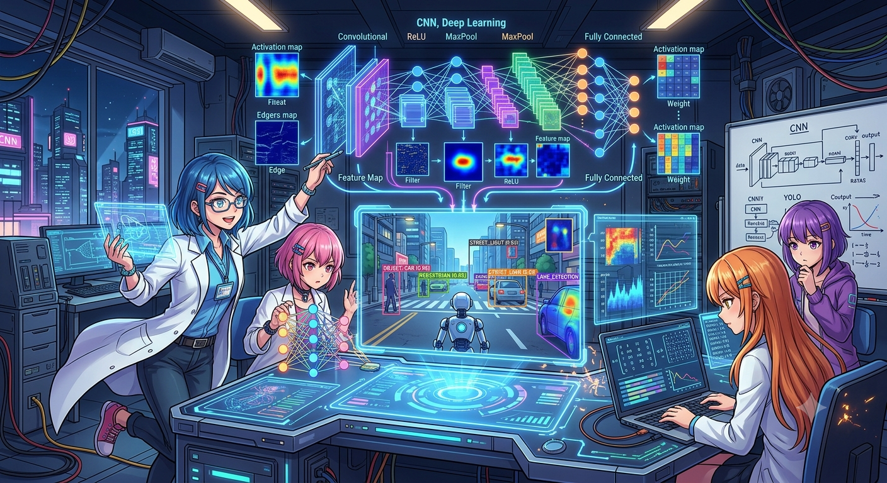

---
# La Carrera por la Visión Artificial

- Kunihiko Fukushima (1980): Neocognitron
- Yann LeCun (1998): LeNet-5
- Alex Krizhevsky (2012): AlexNet
- Kaiming He (2015): ResNet

---

# El Hola Mundo del Deep Learning

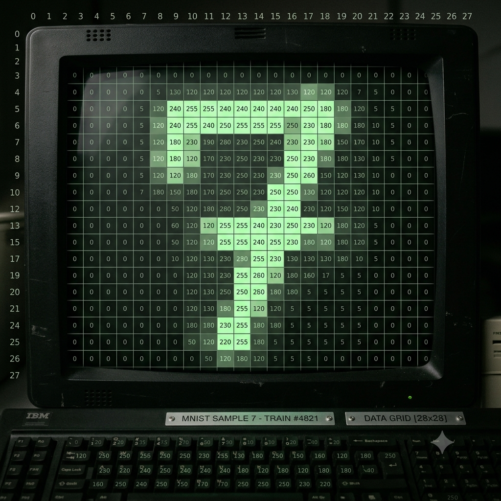

---

# Tensores

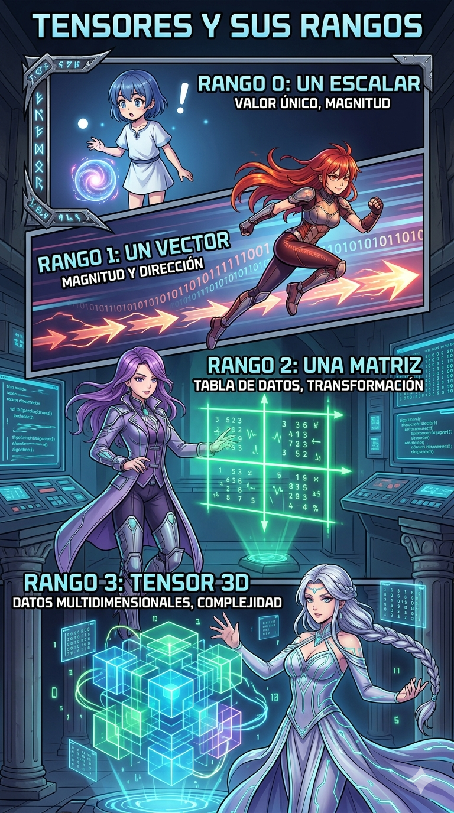

- Rangos 
- Broadcasting 
- reshape

--- 

# Problemas de clasificación binaria:

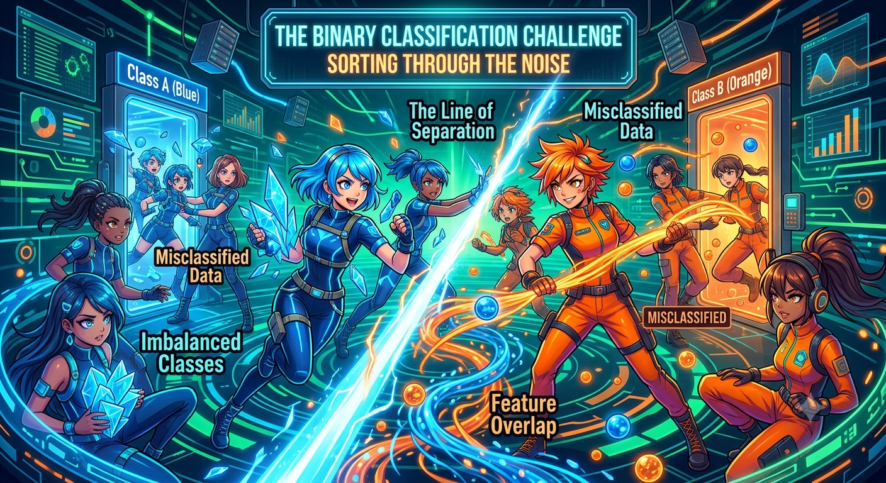

---

# BCELoss

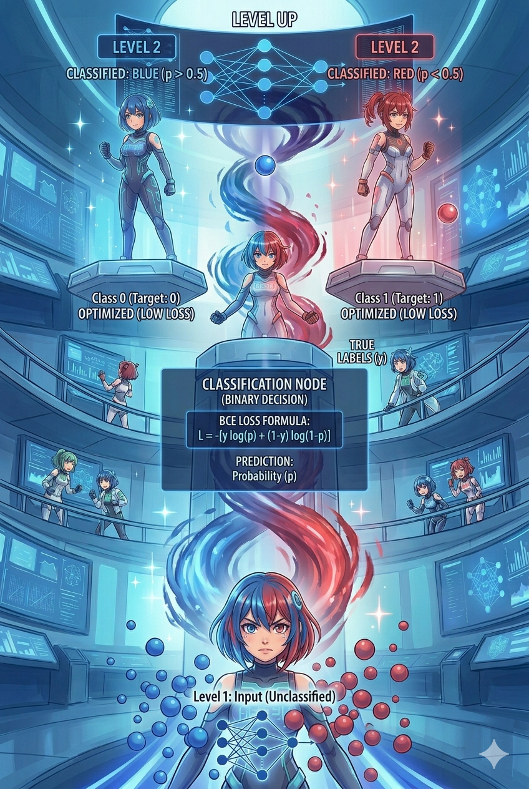

$$
L = -\frac{1}{N}\sum_{i=1}^{N}
\left(
y_i \log(p_i)
+
(1-y_i)\log(1-p_i)
\right)
$$

$$ P_i = \frac{1}{1 + e^{-z_i}} $$

Derivada:

$$ \frac{\partial L}{\partial z_i} = p_i - y_i $$

---

# Accuracy

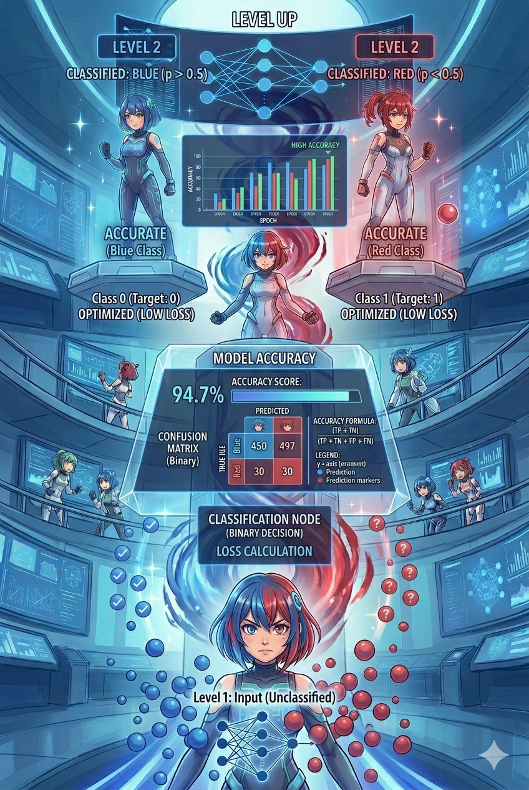

$$ Accuracy = \frac{TP + TN}{Total} $$

---
# Inicialización de pesos

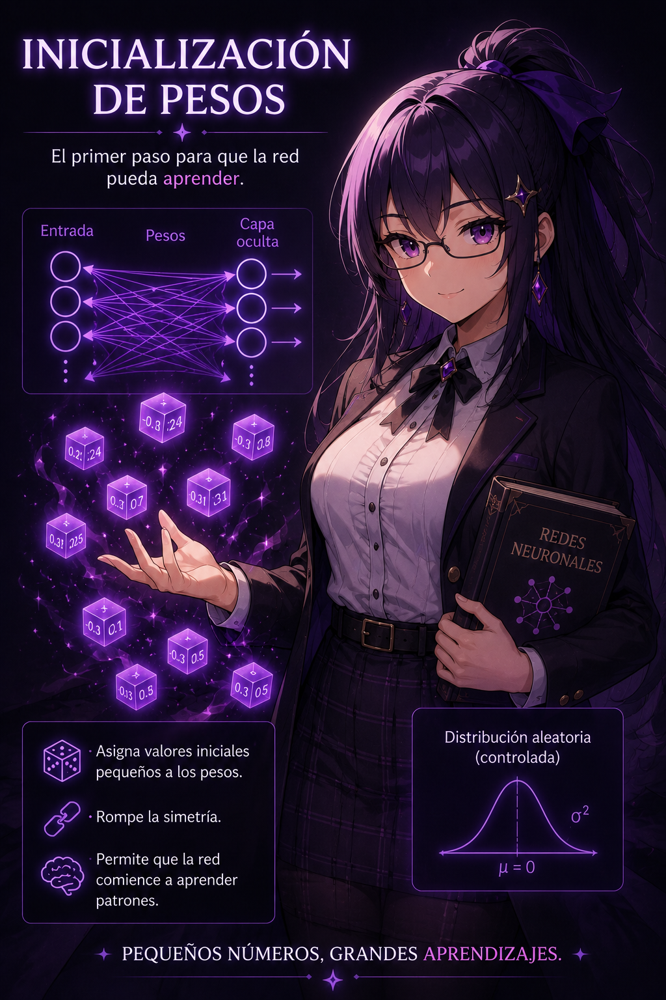

$$
y = \sigma(x \cdot W + b)
$$

- Si $W$ es muy grande, las activaciones también serán muy grandes.
- Si $W$ es muy pequeño, las activaciones también serán muy pequeñas.

> [torch init](https://docs.pytorch.org/docs/main/nn.init.html)

---

# 1) Random Initialization

$$
W \sim \mathcal{N}(0,1)\,\epsilon
$$

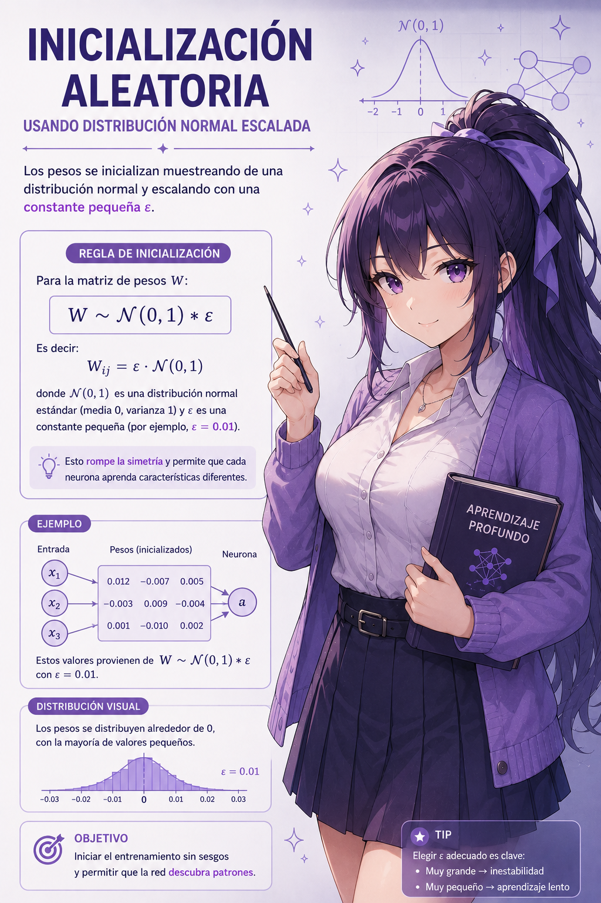

- Es un método clásico que actualmente está en desuso, ya que no controla la varianza de las activaciones en redes profundas.

---

# 2) Zero Initialization

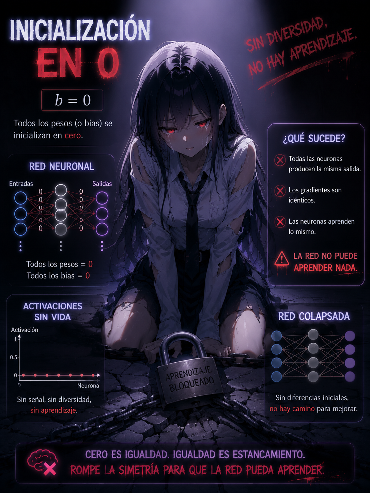

$$
b = 0
$$

- Se utiliza para inicializar los **bias**, pero no los pesos, salvo en algunos casos muy particulares.

---

# 3) Xavier/Glorot Initialization

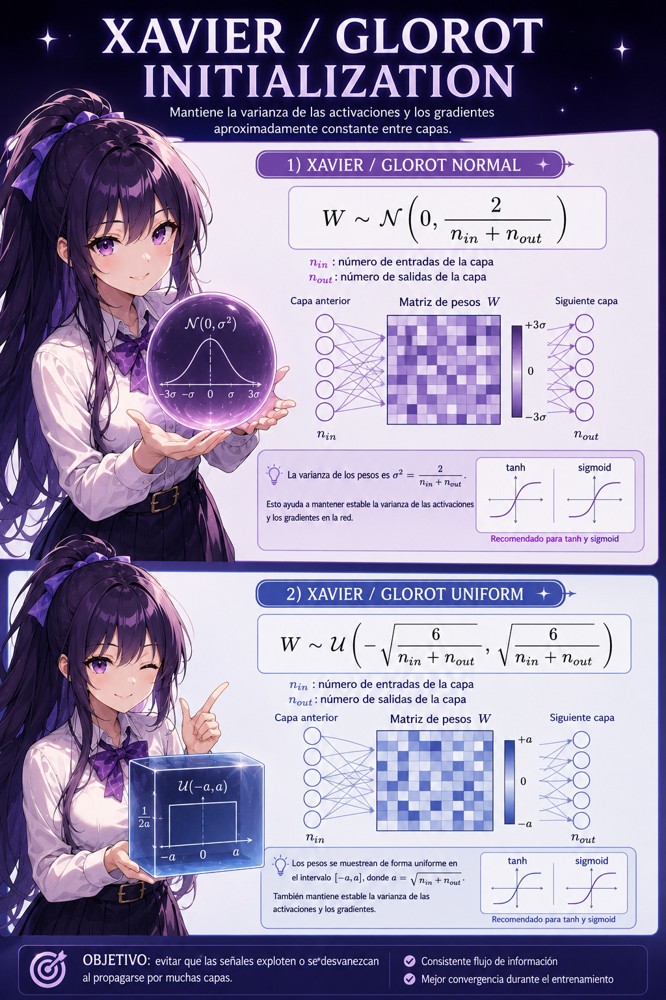

$$
W \sim \mathcal{N}\left(0,\frac{2}{n_{in}+n_{out}}\right)
$$

$$
W \sim \mathcal{U}\left(
-\sqrt{\frac{6}{n_{in}+n_{out}}},
\sqrt{\frac{6}{n_{in}+n_{out}}}
\right)
$$

- Diseñada para mantener aproximadamente constante la varianza de las activaciones entre capas.
- Recomendada para funciones de activación simétricas como **tanh** y **sigmoid**.

---

# 4) He / Kaiming Initialization

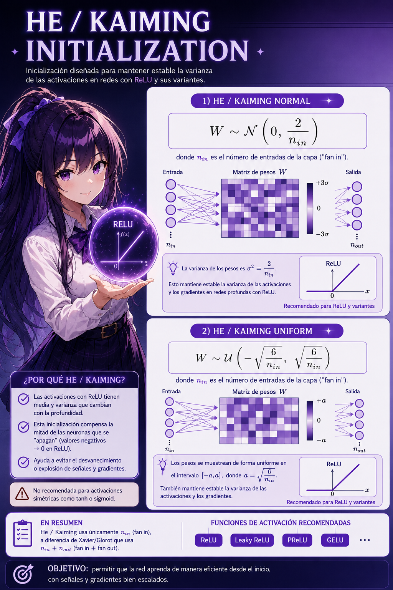

$$
W \sim \mathcal{N}\left(0,\frac{2}{n_{in}}\right)
$$

$$
W \sim \mathcal{U}\left(
-\sqrt{\frac{6}{n_{in}}},
\sqrt{\frac{6}{n_{in}}}
\right)
$$

- Diseñada para mantener aproximadamente constante la varianza de las activaciones en redes con **ReLU** y sus variantes.
- Recomendada para **ReLU**, **Leaky ReLU**, **PReLU**, **GELU** y similares.

---
# Normalización en Redes Neuronales

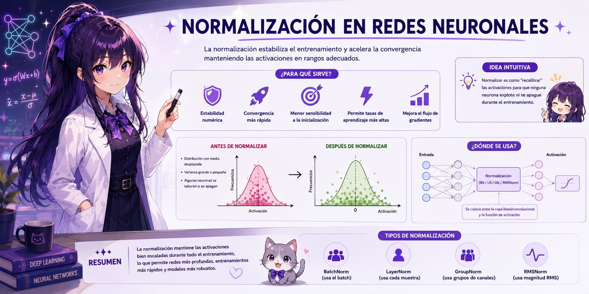

---

# 1) Batch Normalization

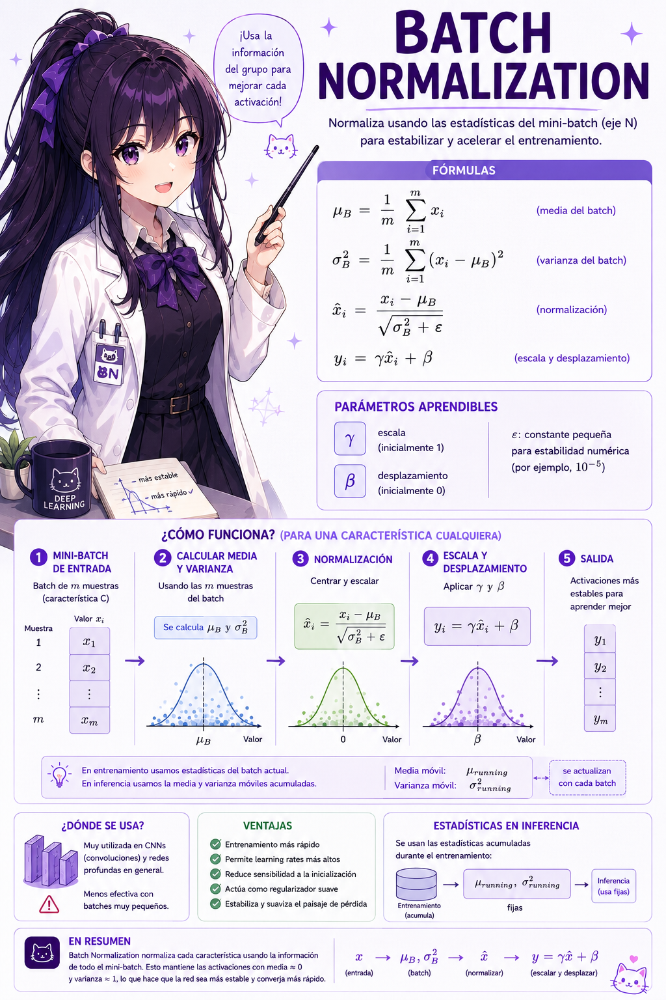

$$
\mu_B=\frac{1}{m}\sum_{i=1}^{m}x_i
$$

$$
\sigma_B^2=\frac{1}{m}\sum_{i=1}^{m}(x_i-\mu_B)^2
$$

$$
\hat{x}_i=\frac{x_i-\mu_B}{\sqrt{\sigma_B^2+\varepsilon}}
$$

$$
y_i=\gamma\hat{x}_i+\beta
$$

- Calcula la media y la varianza usando el **mini-batch**.
- Muy utilizada en CNN.
- Su rendimiento disminuye cuando el batch es muy pequeño.

---
### Derivada de Batch Normalization

Sea

$$
\delta_i=\frac{\partial L}{\partial y_i}
$$

La derivada respecto a la entrada es

$$
\frac{\partial L}{\partial x_i}
= \frac{\gamma}{m\sqrt{\sigma^2+\epsilon}}
\left[
m\delta_i - \sum_j\delta_j - \hat{x}_i
\sum_j
\delta_j\hat{x}_j \right]
$$

Además,

$$
\frac{\partial L}{\partial\gamma}
= \sum_i\delta_i\hat{x}_i
$$

$$
\frac{\partial L}{\partial\beta}
=\sum_i\delta_i
$$

> Observe que el gradiente de una muestra depende de todas las muestras del mini-batch.

---

# 2) Layer Normalization

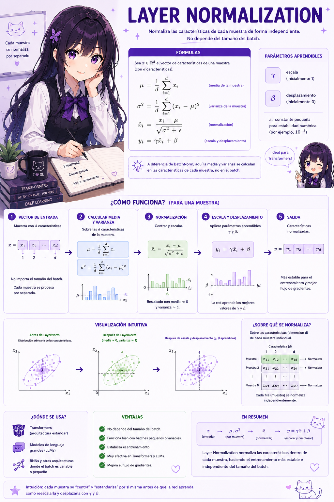

$$
\mu=\frac{1}{d}\sum_{i=1}^{d}x_i
$$

$$
\sigma^2=\frac{1}{d}\sum_{i=1}^{d}(x_i-\mu)^2
$$

$$
\hat{x}=\frac{x-\mu}{\sqrt{\sigma^2+\varepsilon}}
$$

$$
y=\gamma\hat{x}+\beta
$$

- Calcula la media y la varianza para **cada muestra individual**.
- No depende del tamaño del batch.
- Es la normalización estándar en Transformers.

---

### Derivada de Layer Normalization

$$
\frac{\partial L}{\partial x_i} = \frac{\gamma}{d\sqrt{\sigma^2+\epsilon}}
\left[
d\delta_i - \sum_j\delta_j - \hat{x}_i
\sum_j
\delta_j\hat{x}_j \right]
$$

$$
\frac{\partial L}{\partial\gamma} =
\sum_i\delta_i\hat{x}_i
$$

$$
\frac{\partial L}{\partial\beta} = \sum_i\delta_i
$$

> Las sumas se realizan sobre las características de una única muestra.

---

# 3) Group Normalization

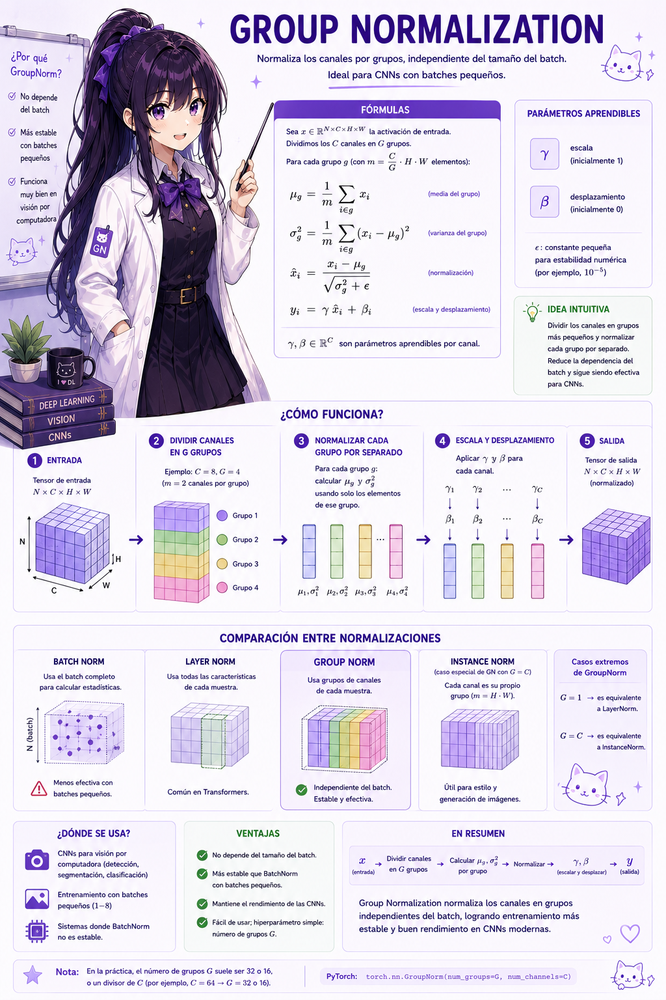

Si existen $G$ grupos de canales,

$$
\mu_g=\frac{1}{m}\sum_{i\in g}x_i
$$

$$
\sigma_g^2=\frac{1}{m}\sum_{i\in g}(x_i-\mu_g)^2
$$

$$
\hat{x}=\frac{x-\mu_g}{\sqrt{\sigma_g^2+\varepsilon}}
$$

$$
y=\gamma\hat{x}+\beta
$$

- Divide los canales en grupos.
- Cada grupo se normaliza de manera independiente.
- Funciona muy bien con batches pequeños.

---

### Derivada de Group Normalization

$$
\frac{\partial L}{\partial x_i} = \frac{\gamma}{m_g\sqrt{\sigma_g^2+\epsilon}}
\left[
m_g\delta_i -
\sum_j\delta_j - \hat{x}_i
\sum_j
\delta_j\hat{x}_j
\right]
$$

$$
\frac{\partial L}{\partial\gamma} = \sum_i\delta_i\hat{x}_i
$$

$$
\frac{\partial L}{\partial\beta} =
\sum_i\delta_i
$$

> Las sumas se realizan únicamente sobre los elementos del grupo.

---

# 4) RMS Normalization

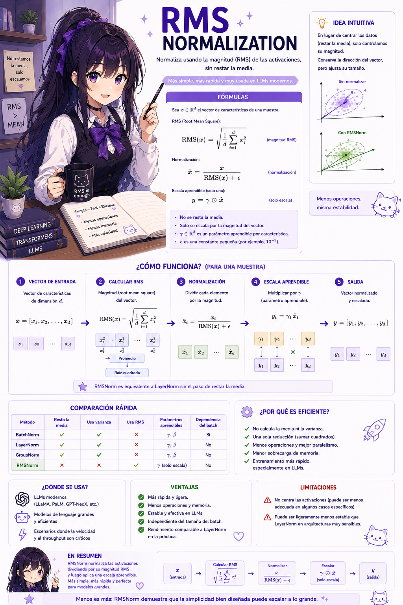

$$
\text{RMS}(x)
= \sqrt{\frac1d\sum_{i=1}^{d}x_i^2}
$$

$$
\hat{x} =
\frac{x}
{\text{RMS}(x)+\varepsilon}
$$

$$
y=\gamma\hat{x}
$$

- No calcula la media.
- Solo normaliza utilizando la magnitud RMS.
- Reduce el costo computacional.
- Muy utilizada en LLM modernos.

--- 

### Derivada de RMS Normalization

Sea

$$
R=\sqrt{\frac1d\sum_i x_i^2+\epsilon}
$$

La salida es

$$
y=\gamma\frac{x}{R}
$$

La derivada respecto a la entrada es

$$
\frac{\partial L}{\partial x} =
\frac{\gamma}{R} \left(
I- \frac{xx^T}{dR^2} \right)
\delta
$$

Además,

$$
\frac{\partial L}{\partial\gamma}
= \sum_i\delta_i\hat{x}_i
$$

> RMSNorm no requiere derivar la media ni la varianza, por lo que su backward es más simple.

---

# 5) Instance Normalization

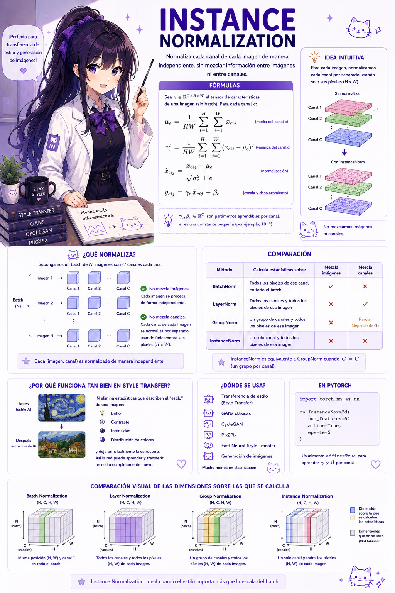

$$
\mu_c=\frac1{HW}\sum x_{cij}
$$

$$
\sigma_c^2=\frac1{HW}\sum(x_{cij}-\mu_c)^2
$$

$$
\hat{x}=\frac{x-\mu_c}{\sqrt{\sigma_c^2+\epsilon}}
$$

$$
y=\gamma\hat{x}+\beta
$$

- Normaliza cada canal de cada imagen por separado.
- Muy utilizada en Style Transfer y GANs.
- Equivale a GroupNorm cuando \(G=C\).

---

### Derivada de Instance Normalization

$$
\frac{\partial L}{\partial x_i} = \frac{\gamma}{HW\sqrt{\sigma_c^2+\epsilon}}
\left[
HW\delta_i - \sum_j\delta_j -
\hat{x}_i
\sum_j
\delta_j\hat{x}_j
\right]
$$

$$
\frac{\partial L}{\partial\gamma}
= \sum_i\delta_i\hat{x}_i
$$

$$
\frac{\partial L}{\partial\beta} =
\sum_i\delta_i
$$

> Cada imagen y cada canal se derivan de forma independiente.

---
# Problemas de clasificación multiclase:

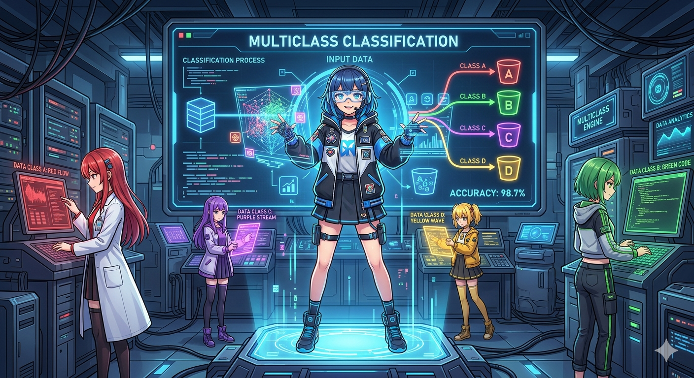

---
# CrossEntropyLoss

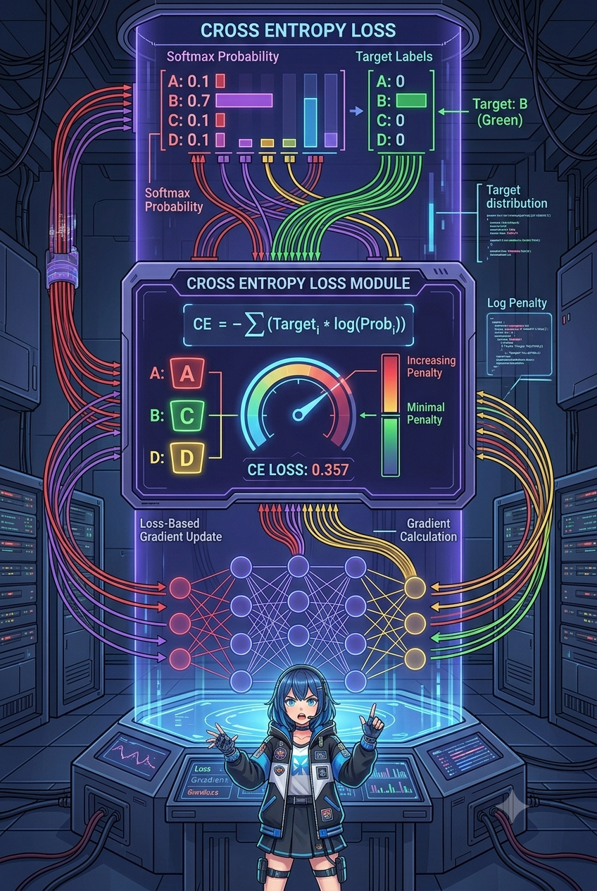

$$ L = -\frac{1}{N} \sum_{i=1}^{N} \sum_{j=1}^{C} y_{ij} \log(p_{ij}) $$

$$ P_{ij} = \frac{e^{z_{ij}}}{\sum_{k=1}^{C} e^{z_{ik}}} $$

Derivada:

$$ \frac{\partial L}{\partial z_{ij}} = p_{ij} - y_{ij} $$

--- 
# Softmax

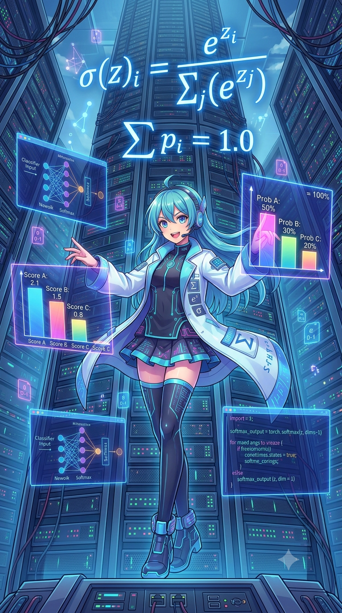

$$
p_j = \frac{e^{z_j}}{\sum_{k=1}^{C} e^{z_k}}
$$

Derivada:

$$
\frac{\partial p_j}{\partial z_i} =
\begin{cases}
p_j(1 - p_j) & \text{si } i = j \\
-p_j p_i & \text{si } i \neq j
\end{cases}
$$

---
