# Inteligencia Artificial

## Yoel Andeyci Pilier Martinez

### [yapmartinez@oymas.edu.do](mailto:yapmartinez@oymas.edu.do)

---
# Redes Neuronales Convolucionales (CNN)

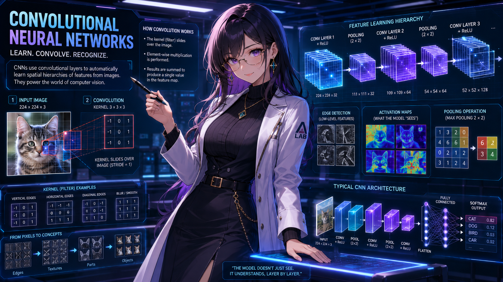

---
# Convolución 

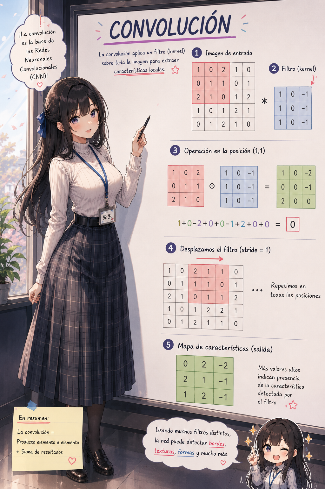

$$(I * K)(i, j) = \sum_{m=0}^{M} \sum_{n=0}^{N} I(i + m, j + n) K(m, n)$$

$$
H_{out} =
\left\lfloor
\frac{
H_{in}
+2P_h -D_h(K_h-1) -1
}{S_h}
\right\rfloor
+1
$$

$$
W_{out} =
\left\lfloor
\frac{
W_{in}
+2P_w -D_w(K_w-1) -1
}{S_w}
\right\rfloor
+1
$$

---
# Convolución 

- **in_channels**
- **Out_channels**
- **Kernel**
- **Padding** 0 por defecto
- **Stride**  1 por defecto
- **Dilation** 1 por defecto

---

# Convolución Transpuesta

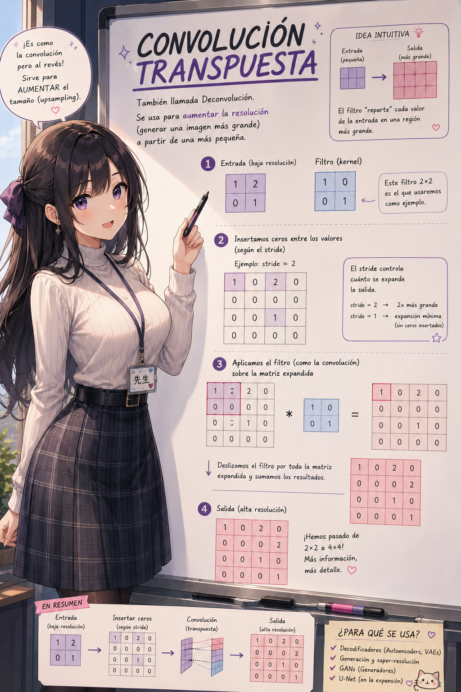

$$
O(iS_h+aD_h-P_h,\;jS_w+bD_w-P_w)
\mathrel{+}=
I(i,j)K(a,b)
$$

$$
a=0,\dots,K_h-1,
\quad
b=0,\dots,K_w-1
$$

$$
H_{out} =
(H_{in}-1)S_h -2P_h
+D_h(K_h-1)
+\mathrm{outPad}_h
+1
$$

$$
W_{out} =
(W_{in}-1)S_w -2P_w
+D_w(K_w-1)
+\mathrm{outPad}_w
+1
$$

---

# Convolución Transpuesta

- **in_channels**
- **out_channels**
- **kernel_size**	
- **stride** 1 por defecto
- **padding** 0 por defecto
- **output_padding** 0 por defecto
- **Dilation** 1 por defecto

--- 

# Derivadas

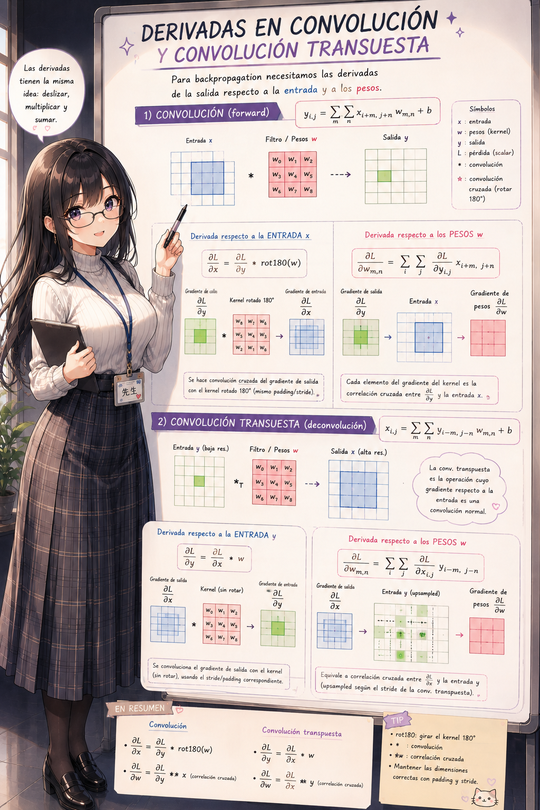

- Convolución:

$$
\frac{\partial L}{\partial X} = \text{ConvTranspose}
\left(
\frac{\partial L}{\partial Y},
W
\right)
$$

$$
\frac{\partial L}{\partial W} = X * 
\frac{\partial L}{\partial Y}
$$

- Convolución Transpuesta:

$$
\frac{\partial L}{\partial X} =
\frac{\partial L}{\partial Y} *
W
$$

$$
\frac{\partial L}{\partial W} =
X_{\uparrow} *
\frac{\partial L}{\partial Y}
$$

--- 

# Pooling

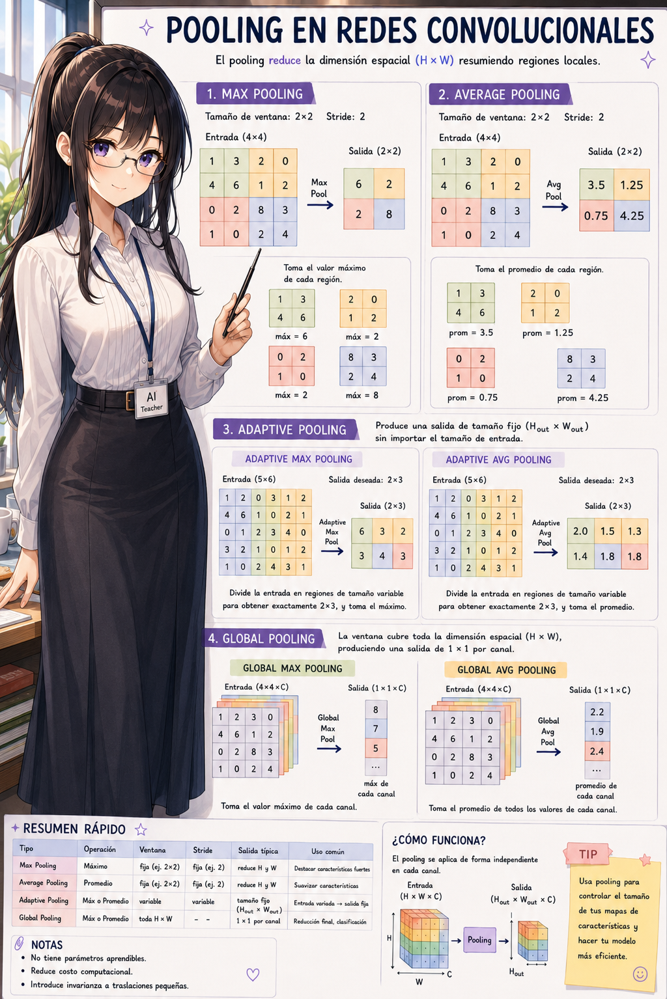
 
$$
H_{out} =
\left\lfloor
\frac{H_{in} + 2P_H - D_H(K_H - 1) - 1}{S_H} + 1
\right\rfloor
$$

$$
W_{out} =
\left\lfloor
\frac{W_{in} + 2P_W - D_W(K_W - 1) - 1}{S_W} + 1
\right\rfloor
$$

---

# Max Pooling

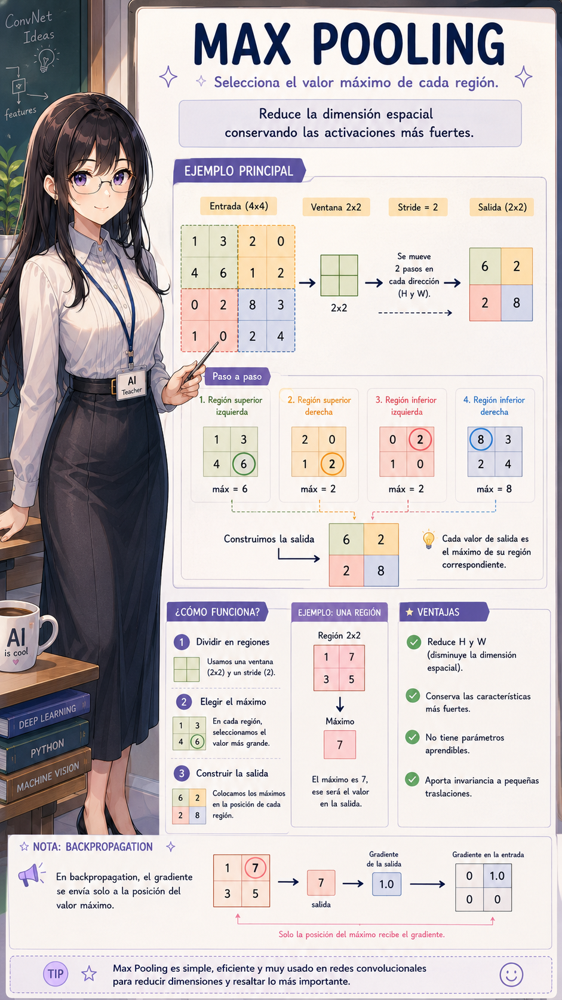

$$
Y_{i,j,c}=
\max_{(h,w)\in R_{i,j}}
X_{h,w,c}
$$

Derivadas:

$$
\frac{\partial L}{\partial X_{h,w,c}}=
\sum_{i,j : (h,w)\in R_{i,j}}
G_{i,j,c}
\mathbf{1}
\left[
X_{h,w,c}=Y_{i,j,c}
\right]
$$

---
# Average Pooling

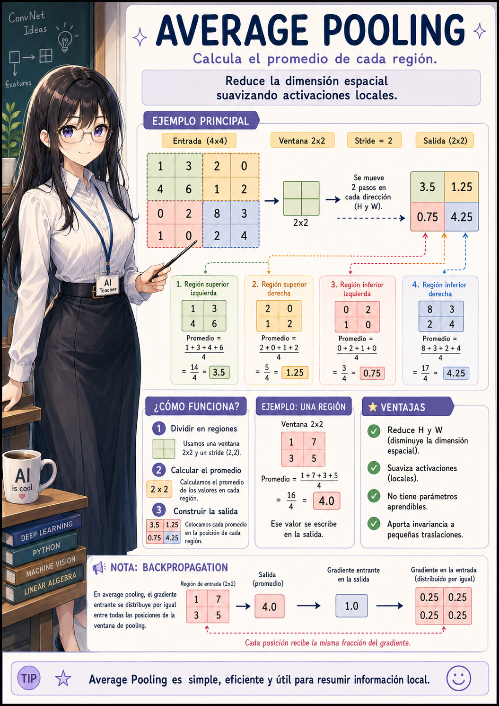

$$
Y_{i,j,c} =
\frac{1}{|R_{i,j}|}
\sum_{(h,w)\in R_{i,j}}
X_{h,w,c}
$$

Derivadas:

$$
\frac{\partial L}{\partial X_{h,w,c}} =
\sum_{i,j : (h,w)\in R_{i,j}}
\frac{G_{i,j,c}}{|R_{i,j}|}
$$

$$
dX =
\frac{dY}{K_HK_W}
$$

--- 

# Adaptive Average Pooling

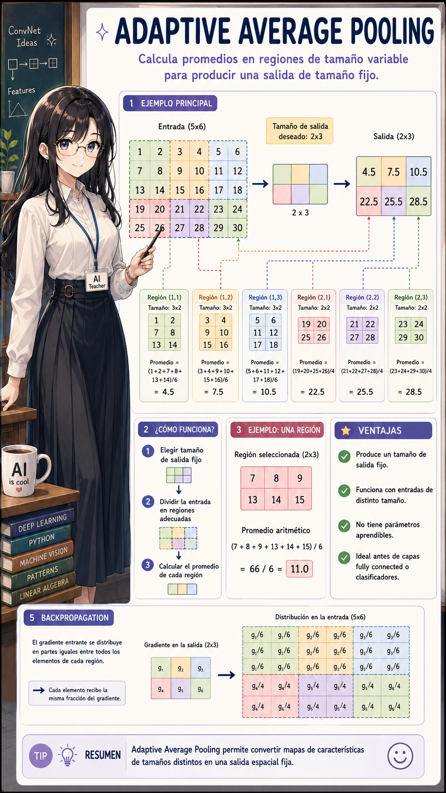

$$
Y_{i,j} =
\frac{1}{|R_{i,j}|}
\sum_{(h,w) \in R_{i,j}}
X_{h,w}
$$

Derivadas:

$$
\frac{\partial L}{\partial X_{h,w}} =
\sum_{i,j}
G_{i,j}
\cdot
\frac{1}{|R_{i,j}|}
\cdot
\mathbf{1}
\left[
(h,w) \in R_{i,j}
\right]
$$

---

# Convolutional Neural Networks (CNN)

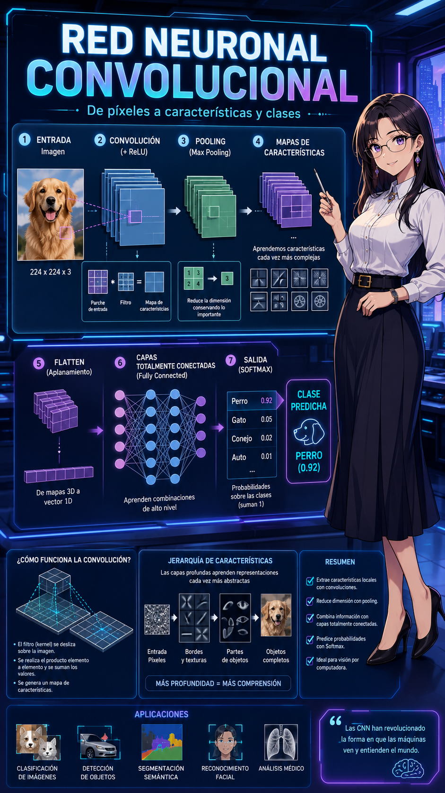

input image → convolutional layer(n) → pooling layer → fully connected layer → output

---

# Dropout 

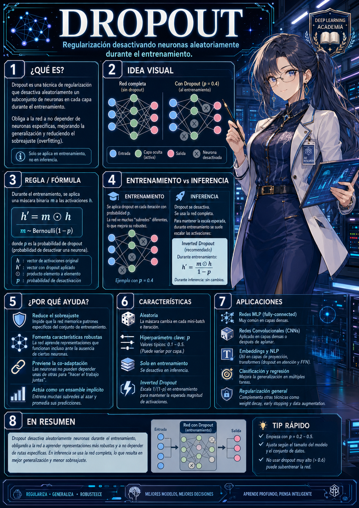

$$ q = 1 - p $$

$$
m \sim \text{Bernoulli}(q)
$$

$$
\mathbf{y} =
\frac{\mathbf{m}}{q}
\odot
\mathbf{x}
$$

Derivadas:

$$
\frac{\partial L}{\partial \mathbf{x}} =
\frac{\mathbf{m}}{q}
\odot
\frac{\partial L}{\partial \mathbf{y}}
$$

Inferencia:

$$
\mathbf{y} = \mathbf{x}
$$

--- 

# Weight Decay

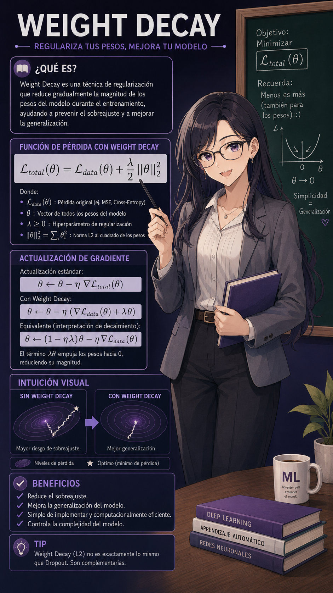

**Función de pérdida:**

$$
\mathcal{L}*{total} = \mathcal{L}*{data} + \frac{\lambda}{2}\sum_i w_i^2
$$

**Derivada de la penalización:**

$$
\frac{\partial}{\partial w_i}\left(\frac{\lambda}{2}w_i^2\right) = \lambda w_i
$$

$\lambda$: Peso de la penalización  $\eta$: Learning rate

--- 

**Actualización del peso:**

$$
w \leftarrow w - \eta(\nabla_w \mathcal{L}_{data} + \lambda w)
$$

**Forma equivalente:**

$$
w \leftarrow (1 - \eta\lambda)w - \eta\nabla_w \mathcal{L}_{data}
$$

> Krogh , A., & Hertz, J. A. (1991). A Simple Weight Decay Can Improve Generalization. 

---

# Aumento de Datos

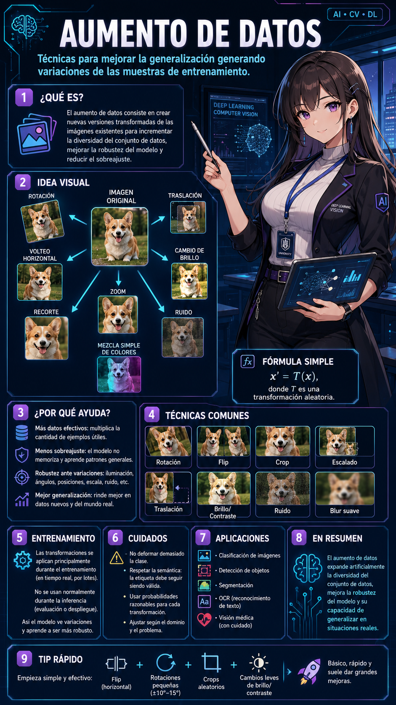

[Transforms](https://docs.pytorch.org/vision/0.11/auto_examples/plot_transforms.html#sphx-glr-auto-examples-plot-transforms-py)
- Random Rotation
- Random Flip Horizontal/Vertical
- Random Crop
- Resize
- Random Deform
- Random Erase
- Random Copy Paste
- ToTensor
- Normalize/Denormalize

---

# Adaptive Moment Estimation (Adam)

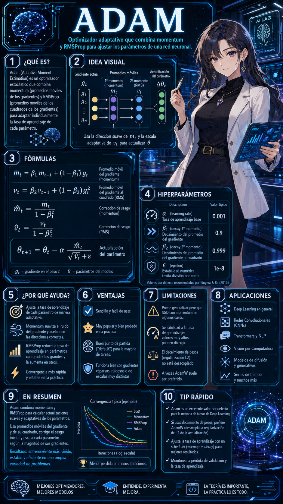

$$
g_t =
\nabla_{\theta} L_t(\theta_{t-1}) +
\lambda \theta_{t-1}
$$

$$
m_t = \beta_1 m_{t-1} + (1 - \beta_1)g_t
$$

$$
v_t = \beta_2 v_{t-1} + (1 - \beta_2)g_t^2
$$

$$
\hat{m}_t = \frac{m_t}{1 - \beta_1^t}
$$

$$
\hat{v}_t = \frac{v_t}{1 - \beta_2^t}
$$

$$
\theta_t =
\theta_{t-1} -
\alpha
\frac{\hat{m}_t}{\sqrt{\hat{v}_t} + \epsilon}
$$

$$
\alpha = 1E^{-3}, \beta_1 = 0.9, \beta_2 = 0.999, \epsilon = 10^{-8}, \lambda = 0
$$

> Diederik P. Kingma, Jimmy Ba. Adam: A Method for Stochastic Optimization. 2014. [arXiv:1412.6980](https://arxiv.org/abs/1412.6980)

---
# Decoupled Weight Decay Regularization (AdamW)

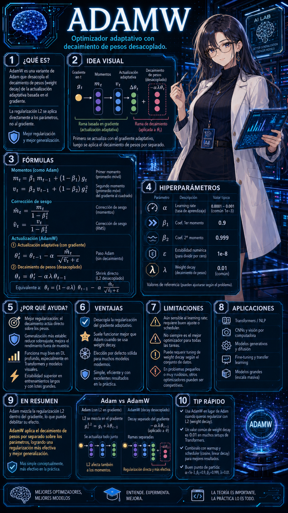

$$
g_t = \nabla_{\theta} L_t(\theta_{t-1})
$$

$$
m_t = \beta_1 m_{t-1} + (1 - \beta_1)g_t
$$

$$
v_t = \beta_2 v_{t-1} + (1 - \beta_2)g_t^2
$$

$$
\hat{m}_t = \frac{m_t}{1 - \beta_1^t}
$$

$$
\hat{v}_t = \frac{v_t}{1 - \beta_2^t}
$$

$$
\theta_t =
\theta_{t-1} -
\alpha \lambda \theta_{t-1} -
\alpha
\frac{\hat{m}_t}{\sqrt{\hat{v}_t} + \epsilon}
$$

$$
\alpha = 1E^{-3}, \beta_1 = 0.9, \beta_2 = 0.999, \epsilon = 10^{-8}, \lambda = 0.01
$$

> Ilya Loshchilov, Frank Hutter. Decoupled Weight Decay Regularization. 2017. [arXiv:1711.05101](https://arxiv.org/abs/1711.05101)
---

# Deep Residual Networks (ResNet)

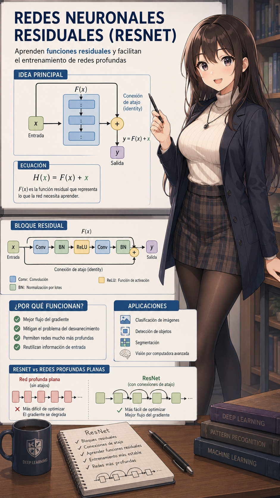

$$
y = F(x, \{W_i\}) + x
$$

> Kaiming He, Xiangyu Zhang, Shaoqing Ren, Jian Sun. Deep Residual Learning for Image Recognition. 2015. [arXiv:1512.03385](https://arxiv.org/abs/1512.03385)

---

# Nearest Upsampling

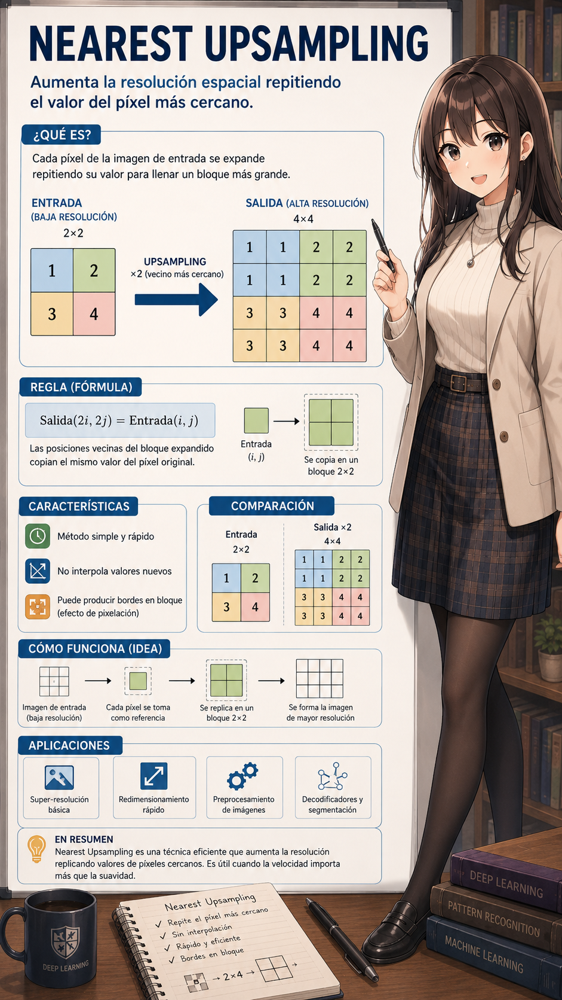

$$
Y_{c, rh+i, rw+j} = X_{c,h,w}
$$

Derivadas:

$$\frac{\partial L}{\partial X_{c,h,w}} =
\sum_{i=0}^{r-1}
\sum_{j=0}^{r-1}
\frac{\partial L}{\partial Y_{c,rh+i,rw+j}}
$$

--- 

# Bilinear Upsampling

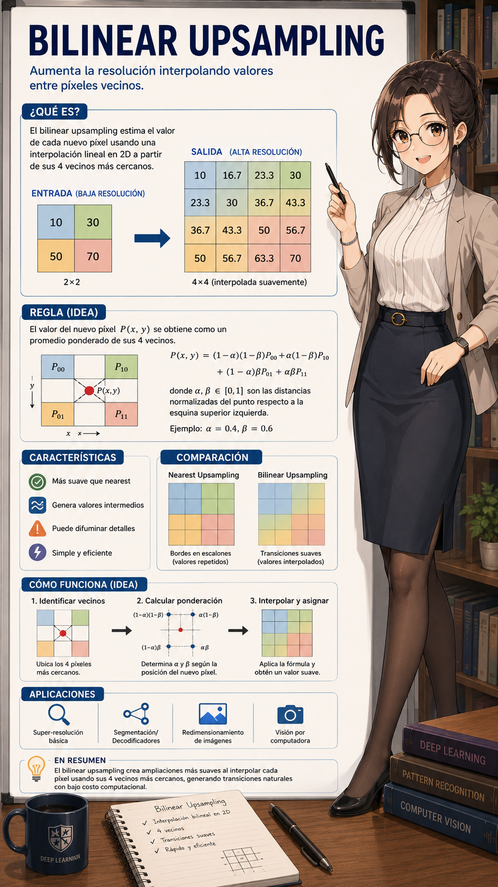

$$
Y = (1-\alpha)(1-\beta)X_{00}
+
\alpha(1-\beta)X_{10}
+
(1-\alpha)\beta X_{01}
+
\alpha\beta X_{11}
$$

Derivadas:

$$
\frac{\partial L}{\partial X_{00}} =
(1-\alpha)(1-\beta)
\frac{\partial L}{\partial Y}
$$

$$
\frac{\partial L}{\partial X_{10}} =
\alpha(1-\beta)
\frac{\partial L}{\partial Y}
$$

$$
\frac{\partial L}{\partial X_{01}} =
(1-\alpha)\beta
\frac{\partial L}{\partial Y}
$$

$$
\frac{\partial L}{\partial X_{11}} =
\alpha\beta
\frac{\partial L}{\partial Y}
$$

---

# Pixel Shuffle 

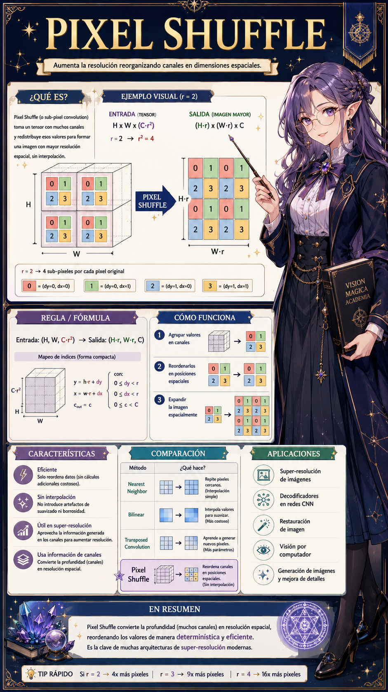

$$
Y_{c,rh+i,rw+j} =
X_{cr^2 + ir + j,h,w}
$$

Derivadas:

$$
\frac{\partial L}{\partial X_{cr^2 + ir + j,h,w}} =
\frac{\partial L}{\partial Y_{c,rh+i,rw+j}}
$$

---
# Pixel Unshuffle

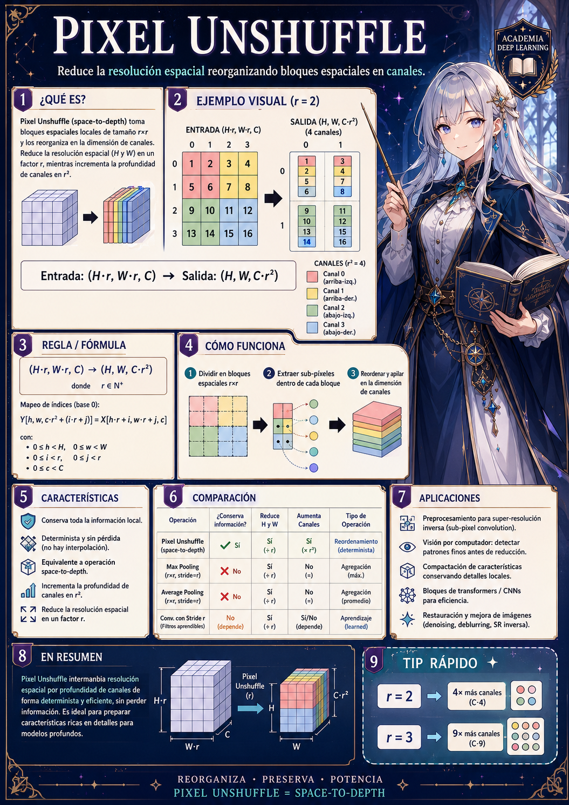

$$
Y_{cr^2 + ir + j,h,w} =
X_{c,rh+i,rw+j}
$$

Derivadas: 

$$
\frac{\partial L}{\partial X_{c,rh+i,rw+j}} =
\frac{\partial L}{\partial Y_{cr^2 + ir + j,h,w}}
$$

---

# AutoEncoder

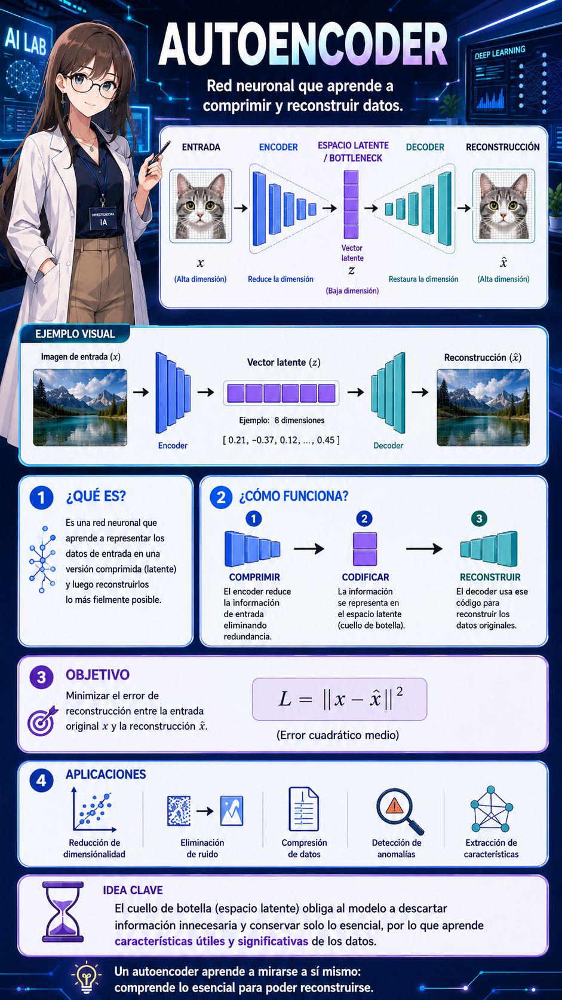

$$
z = f_\theta(x)
$$

$$
\hat{x} = g_\phi(z)
$$

$$
L = \|x - \hat{x}\|^2
$$

---

